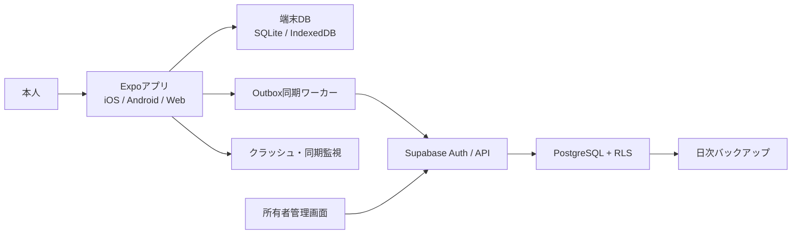

# アーキテクチャ

## 1. 採用構成

- TypeScript + React Native + Expo Router
- iOS / Android / Web / PWAの単一アプリ
- Supabase Auth + PostgreSQL + Row Level Security
- PostgreSQL関数またはSupabase Edge Functions
- iOS/Androidの端末DB: Expo SQLite
- Webの端末DB: IndexedDB
- iOS/Androidの認証情報: SecureStore
- CI: GitHub Actions

Expo SQLiteのWeb対応はalphaであるため、Web本番はIndexedDBアダプターを使います。ドメイン層は`LocalRepository`へ依存し、端末別実装を分離します。

## 2. 構成図



## 3. 層

| 層 | 責務 |
|---|---|
| Presentation | 画面、入力、アクセシビリティ、状態表示 |
| Application | ユースケース、画面間の調整、同期開始 |
| Domain | 採点、克服、間隔反復、状態遷移、集計 |
| Repository | ローカル・リモートデータアクセスの抽象 |
| Infrastructure | SQLite、IndexedDB、Supabase、監視 |

ドメイン層をReact、Expo、Supabaseへ依存させず、単体テスト可能にします。

## 4. セキュリティ境界

- クライアントにはSupabase URLとpublishable keyだけを置きます。
- `service_role`、DBパスワード、署名鍵はサーバー限定です。
- ユーザー所有データはRLSで`auth.uid() = user_id`を強制します。
- 管理操作は管理者claimとサーバー検証を要求します。
- 回答結果はサーバーで再採点します。
- オフライン問題パックは端末解析に対する完全秘匿を保証しません。個人学習では可用性を優先します。

## 5. 環境

- development: ローカルSupabase、サンプル問題
- staging: 本番同等、テストアカウント、レビュー候補問題
- production: 本人の実データ、公開済み問題

プロジェクト、キー、DBを環境別に分離し、本番データを開発へコピーしません。

## 6. リポジトリ構成

```text
app/                     Expo Router画面
src/components/          UI部品
src/features/            機能単位
src/domain/              採点・復習・状態遷移
src/repositories/        保存抽象
src/storage/native/      Expo SQLite
src/storage/web/         IndexedDB
src/sync/                Outbox・差分同期・競合
src/services/            Supabase/API
src/theme/               デザイントークン
supabase/migrations/     DB変更
supabase/functions/      サーバー処理
supabase/tests/          DB・RLSテスト
content/schema/          問題schema
content/samples/         公開サンプル
docs/                    設計書
tests/                   横断テスト
```

本番500題と秘密情報は公開GitHubへ置きません。

