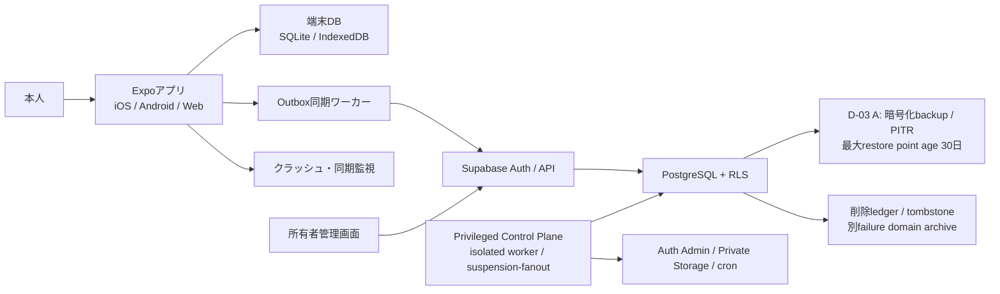

# アーキテクチャ

## 1. 採用構成

- TypeScript + React Native + Expo Router
- iOS / Android / Web / PWAの単一アプリ
- Supabase Auth + PostgreSQL + Row Level Security
- neutral NOLOGIN function-ownerが所有するPostgreSQL SECURITY DEFINER関数（client/internalをEXECUTE ACLで分離）
- 専用最小権限DB roleで動くisolated workerによるPrivileged Control Plane（reauth、模試finalizer、data ops、`suspension-fanout`）
- iOS/Androidの端末DB: Expo SQLite
- Webの端末DB: IndexedDB
- iOS/Androidの認証情報: SecureStore
- CI: GitHub Actions

Expo SQLiteのWeb対応はalphaであるため、Web本番はIndexedDBアダプターを使います。ドメイン層は`LocalRepository`へ依存し、端末別実装を分離します。

## 2. 構成図



## 3. 層

| 層 | 責務 |
|---|---|
| Presentation | 画面、入力、アクセシビリティ、状態表示 |
| Application | ユースケース、画面間の調整、同期開始 |
| Domain | サーバー採点canonicalの検証・適用、克服、間隔反復、状態遷移、集計 |
| Repository | ローカル・リモートデータアクセスの抽象 |
| Infrastructure | SQLite、IndexedDB、Supabase、監視 |

ドメイン層をReact、Expo、Supabaseへ依存させず、単体テスト可能にします。client domainは正答集合を保持せず、選択内容から正誤・scoreを再計算しません。未同期回答はpending intentとして扱い、サーバーcanonical response/changeのgrading status、`isCorrect`、score、訂正・無効化だけをstrict検証してlocal projectionへ適用します。回答後feedbackの`questionExplanation/takeaway/commonTrap`も採点済みcanonical responseだけから適用し、回答前catalog/sessionへ射影しません。

端末正本はowner/data generation namespaceごとにlocal/remote session状態、source event/sequence/revision/received metadata、append-only lifecycle/result/issue/session-item-invalidation fact ID/hash、selection basis/lifecycle、command receiptをlosslessに保持します。bootstrapはowner/preview acceptanceと全sectionのquestion versionをlockし、suspended、fanout pending、acceptance-revoked版のcatalog/session item/basis contentをNULL tombstone、feedbackを0件にします。basis ID・順序・lifecycle/hashは不変で、safe contentだけavailable/suspended/acceptance-revoked unionにします。catalog/item invalidationの適用時に同版本文/feedback cacheを原子的にpurgeします。同一generationでもserver terminal/lifecycle/content/tombstone/attempt/factを優先します。保持可能なlocal intentは未ACK `session.created`、未ACK offline pack issue/consume専用command、pending answer、draft/note/bookmark/issue未ACK mutation、未解決conflictだけです。basisはrow hash exact一致かつserver lifecycle=`unconsumed`だけをrebaseし、それ以外をquarantineしてterminalを復活させません。本文なしportable export型とは分離します。generation不一致時は旧namespaceをstrict source branch付きで隔離し、現在namespaceへoverlay・再送・暗黙ACKしません。

## 4. セキュリティ境界

- クライアントにはSupabase URLとpublishable keyだけを置きます。
- `service_role`、DBパスワード、署名鍵はサーバー限定ですが、`service_role`にもlearner/content/control-plane基礎tableの直接SELECT/DMLまたはclient/internal RPCのEXECUTEをgrantしません。全`SECURITY DEFINER`関数はneutral NOLOGIN function-ownerが所有し、関数実行中のdefiner identityをcaller判定へ使用しません。
- ユーザー所有データはRLSで`auth.uid() = user_id`を強制します。
- 管理操作は管理者claimとサーバー検証を要求します。
- 回答結果はサーバーで採点します。回答前の端末・Web bundleへ正答と解説を置きません。
- Auth session revoke、export/restore/delete、模試期限finalizer、`content-control`、`suspension-fanout`はclient用RPCと分離したisolated workerで処理します。suspend targetはgraded未invalidated attempt、最新実効exam revision、最新offline result/feedback pair、未invalidated session itemだけをID/hash付きでfreezeし、過去/無効/not-graded/後着を除外します。workerは保存済みmemberからsession item invalidation fact ID/hash等をappendしlive再scanしません。retireはcurrent catalog membershipへexact一件のtombstoneを作るだけで、pinを保持しfanout/member/linkを作りません。
- JSON restoreはserver署名済みportable exportだけを受け付け、端末pre-answer snapshotやclient再計算checksumを正本にしません。
- restore identity artifactはsource export/payload hash、owner/user、別々のactor principal digest/pseudonym集合、0件を含むkind別全portable fact registry、content ref、session/event/command/basis集合を子rowへ正規化し、count/hash/setsHash/artifactHashを子rowから再計算してdry-run/finalizeへexact bindingします。materialization linkはappend-only link ID/time/hashを持ち、session-item branchはfact ID/hash/session/item、remote-source branchはsource kind/ID/generation/sequence/revision/received/hashをlossless保存します。legacy v1 branchだけsource generationをNULLとし、legacy schema/event ID/sequence/fact hashを保存して存在しないcanonical hashを生成しません。restored command archiveはexam.submit/session.abandon/exam.offline-referenceだけで、selection-basis discardはvalidatorで拒否します。
- account deletionはproductionの唯一有効なD-03 A policyをchallengeへpinします。live DB/Auth/Storage削除deadlineは`acceptedAt + 24 hours` exact、backupからの実効消去期限は`acceptedAt + 30 days` exactで、別field・別監視にします。challengeからcombined receipt/DR manifestまで両期限をexact結合し、24時間と30日の混同を拒否します。
- isolated workerのAuth Admin credentialとDB credentialを分離します。client RPCはauthenticatedだけへEXECUTEをgrantして`auth.uid()`からownerを導出します。internal RPCは用途ごとのexact専用NOLOGIN execution roleだけへgrantし、worker LOGIN roleには対応する一roleへの`SET ROLE`だけを許可します。内部RPCはclaim済みjob/member、lease/fencingを検証し、`auth.uid()`やclient入力user IDへ依存しません。runtime capabilityは基礎tableへ到達しない固定safe RPCだけをanon/authenticatedへgrantします。
- controlled private artifactを固定bucket/key/version/etag/size/type/raw hashでcreate-only保存します。human enqueue receiptはrequested-by principal snapshot・human request/response hash、content-control job/claimは別のinternal operation principal・internal request hashとoperation/target/lease/fencing/capabilityを固定し、両principal/preimageのコピー・同一視を禁止します。human recent-authは本人操作またはUI suspend/retire enqueueでだけ消費し、stage/publish/suspend/retire internal receiptはreauth NULLです。保存receipt replayのACL/ID/kind/internal principal/internal hash検証をlease/claim検証より先に行い、authenticated direct internal call、任意URL/client keyを拒否します。

確定回答とdraftが競合した時はattemptが正本です。serverはdraftを更新せずcanonical `superseded-by-answer` ACKを返し、bootstrapとkill/restart replayも同じ結果へ収束します。

## 5. Transaction lock境界

user scopedなversion依存処理の唯一の順序は`user advisory shared/exclusive → question version UUID byte昇順 shared/exclusive → aggregate/event advisory → session/attempt row → projection/materialized row`です。version非依存処理はversion段を空集合として通過します。global問題suspendだけはversion exclusive lock中にuser lockを取得せず、global status、catalog tombstone、immutable fanout memberを確定してcommitします。利用者別fanoutは後続の別transactionで上記順序に従います。restore finalizeはexclusive user lock後に参照全versionをUUID byte昇順にshared lockし、suspended/revoked版を再開可能な状態へ復活させません。

未consume selection basisは利用者の明示`discard-selection-basis` commandが作るappend-only discard lifecycleでのみ無効化します。server reasonは通常`user_discarded`、直前empty-namespace restore dry runが列挙したcurrent-generation basisだけ`restore_empty_namespace_cleanup`です。旧generation namespaceはserver command/factへ偽装せず、端末内のstale namespace atomic discard auditだけが`generation_superseded`を記録します。discard basis/fact/command receiptはserver/local control auditだけに残してportable export/restore replayへ含めません。dry runはactiveな未consume・未discard basis IDを拒否原因として返し、暗黙discardしません。canonical discard ACK後に利用者が新しいdry runを実行し、finalizeはexclusive user lock下で空判定を再実行するだけです。consume済みbasisや学習factの置換・mergeは行いません。

## 6. 環境

- development: ローカルSupabase、サンプル問題
- staging: 本番同等、テストアカウント、レビュー候補問題
- production: 本人だけをallowlistした実データ、本人利用へ承認済みの問題。self-sign-upと一般公開を無効化

プロジェクト、キー、DBを環境別に分離し、本番データを開発へコピーしません。

DB-first cutoverのrequired `database` checkは、(1) 空DBへの全migration fresh適用、(2) origin/main-shaped schema/fixtureからのupgrade、(3) fresh/upgrade双方でcombined migration順序一致、(4) preflight/constraint/worker契約の異常注入時にschema・data・migration履歴が部分適用されないatomic failure、(5) synthetic fixture canaryがproduction migration/seed/artifactへ0件、を独立phaseで実DB検証します。一phaseでも未実行・失敗ならruntime capabilityを発行せず、`content-release-v2`を有効化しません。

## 7. リポジトリ構成

```text
app/                     Expo Router画面
src/components/          UI部品
src/features/            機能単位
src/domain/              サーバー採点結果の適用・復習・状態遷移
src/repositories/        保存抽象
src/storage/native/      Expo SQLite
src/storage/web/         IndexedDB
src/sync/                Outbox・差分同期・競合
src/services/            Supabase/API
src/theme/               デザイントークン
supabase/migrations/     DB変更
supabase/functions/      サーバー処理
supabase/tests/          DB・RLSテスト
content/schema/          問題schema
content/samples/         公開サンプル
docs/                    設計書
tests/                   横断テスト
```

本番500題と秘密情報は公開GitHubへ置きません。

## 8. 保存と復旧の4境界

| 利用者向けの呼び方 | 目的 | できること | できないこと |
|---|---|---|---|
| この端末に保存 | SQLite / IndexedDBへ一問・一操作ごとに保存 | オフライン継続、強制終了後の同じ問題・選択・scroll復元 | 未同期のまま端末を失った場合の復旧 |
| アカウントへ同期 | PostgreSQLの本人namespaceをサーバー正本へ収束 | スマホとWebの同一アカウントで続きから再開、競合検知 | 過去の好きな時点へ戻すbackup |
| 運営のDRバックアップ | 障害時にサービス全体を復旧 | 暗号化されたDB/Auth/private Storageを運営が隔離環境へ復元 | 本人のdownload、個別回答のundo、回答前の正答閲覧 |
| ポータブル書き出し | 本人が自分の学習履歴を持ち出す | server署名JSONのempty-namespace restore、閲覧用CSV | 問題文・選択肢・正答・解説の持出し、CSVからのrestore |

D-03はAで確定します。「最大30日」はbackupを30日待ってから戻す意味ではなく、利用可能なrestore pointの最大経過日数とrotation上限です。事故を検知したら即時に隔離復旧を開始し、RPO 24時間以内、RTO 8時間以内を必須目標にします。退会済みaccountのデータは外部署名済み削除chainをtraffic開始前に再適用し、backup rotationを含め削除受付から30日以内に復元可能backupからも実効消去します。

## 9. オフライン・同一状態・適応表示

通常演習のoffline packは専用`issue_offline_practice_pack_v2`で1 pack・1 selection basis・1 reserved session IDを同一server transactionで発行し、専用`consume_offline_practice_pack_v2`だけがstrict `session.created`を検証して三者とsession itemを一transactionで一回だけ確定します。issue/consumeは別operation ID、request/response hash、strict response JSON、receipt IDをappend-only receiptへ保存し、同operation/hashは保存response、異内容は拒否します。別session/basisへの転用や二つ目のsessionを一意制約で拒否し、端末は両専用commandだけをoutbox再送します。packはsafe prompt/choicesだけで、正答・解説・feedbackを含みません。

章分析はAPI正本の`get_learning_projection_v2`と`get_chapter_readiness_v2(projectionSnapshotHash)`だけを使います。projectionとreadinessの双方へ`expiresAt`/`ttlPolicyVersion`をlossless保存して各hash preimageへ含め、同owner/generation/scope/acceptance/basis/formula/sourceUpper/chapter hash/calculatedAt/TTLをDB FK/CHECKでexact一致させます。DB時計が共通expiresAt以上ならexpiredとして再利用を拒否し、clientは端末時計から期限延長しません。

厳格模試はDB時計で開始・期限・提出を確定するonline verified経路だけを正式成績とします。オフラインで解く40問は別の`offline_unverified`参考結果であり、端末時計未検証と明示し、正式合否、verified模試履歴、SRS、合格見込みprojectionへ昇格させません。再接続後も参考結果RPCへだけ送信し、verified examへ変換しません。

iOS/Android/Webは同じAuth subject、data generation、session/attempt/fact ID、sync/change cursorを使います。違いは表示だけで、スマホはsingle-columnとthumb reach/Webはkeyboard・広幅two-paneを許可しますが、採点、進捗、競合、保存状態、正答開示時点は変えません。responsive breakpointやorientation変更で新sessionを作らず、同一domain stateを再描画します。

## 10. 本人限定review originとpersonal deployment

500問の確認画面はlearner originと分離したowner-only review originへ配備します。EXECUTE許可はowner本人のauthenticated接続に対する7 RPC（begin/get/submit blind/reveal/hide/complete audit/record decision）だけで、PUBLIC/anon/service_role/一般learner/adminを拒否します。各transition responseは`transitionReceiptId`/`operationResponseHash`を返し、DB strict response bytes、local receipt、same-operation replayをexact一致させます。safe resumeはcurrent state/revision/fact hashとblind packetだけを返します。

全層の`DataGeneration`は1以上2^53未満のJSON number/DB BIGINT/local INTEGERです。文字列や範囲外を受けず、owner generation namespaceとhashで数値exact一致させます。

AI reviewは`ContentGenerationArtifactV1` exact 500と、content ref×G0～G12のexact 6,500を別append-only正本へlossless保存します。G12は同一版G0～G11の12 hashをregistry順で必須とし、generator/G2/G12 runを相互分離します。missing/extra/duplicate/stale/issueは0でなければpersonal manifestを作りません。owner review runtime exact sequence `blind -> blind_submitted -> revealed -> hidden -> audit_completed`を検証し、blueprint artifactではblind submission fieldとtransition literal `['blind','revealed','hidden','audit-completed']`へ決定的に射影します。decision=`changes_required`はstrict category/reasonを受け、server生成issue、artifact、audit、receiptを一transactionでappendします。client指定issue、別問題issue、orphanを拒否し、同operation replayは同じissue一式を返します。`pass`はissueを禁止します。
