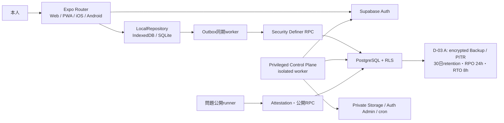

# JSTQB学習アプリ 詳細設計 v2

## 1. 文書の位置づけ

本書は、JSTQB Foundation Levelを学習する個人向け本番アプリの実装基準です。既存の要件・学習・UX・運用設計を具体的な状態遷移、DTO、DB、RPC、試験、リリース単位へ落とし込みます。

本書の承認前は、アプリ機能、DB migration、問題投入、デプロイを開始しません。承認後も、各PRで本書の受入基準を満たすことを要求します。

### 1.1 基線

- Git基線: `origin/main` のPR #6統合後
- 既存main migrationは変更禁止
- PR #2、#3、#5、#7は設計資料としてのみ参照し、そのままmergeまたはcherry-pickしない
- 未コミットのcore、DB、content差分は採用品ではない
- 旧500問bundleは品質承認されていないため、再利用・公開・Git追跡しない

### 1.2 絶対不変条件

1. 回答前DTO、端末snapshot、learner portable export、Web bundleに正答・解説を置かない。確定済みD-03 Aの本番DB正本を暗号化したDR backup/PITRはこの非開示対象外で、通常アクセス不可・KMS・最小権限・隔離restore drillで保護する。
2. 採点、問題版固定、模試期限、合否、学習状態更新はDBを正本とする。
3. 画面遷移前に、ローカル状態とoutboxを同一transactionで保存する。
4. 同じeventの再送は、同じ利用者・同じrequestだけ成功扱いにする。
5. セッション開始時に問題版、問題順、選択肢順を固定する。
6. 確定回答、公開承認、公開・停止監査はappend-onlyにする。
7. 本番問題公開はraw、canonical、manifestの全hashへ本人承認を結び付ける。
8. 既存テストを変更、削除、弱体化しない。仕様追加は新規テストで証明する。

## 2. 機能優先度

### 2.1 P0: 本番開始条件

- メール確認、ログイン、再設定、ログアウト、本人削除
- Web、iOS、Androidの同一アカウント同期
- 選択直後の端末保存、1問単位確定保存、強制終了復旧
- 複数の中断セッション保持と1操作再開
- 通常演習の10 / 20 / 30 / 40問、章別、ランダム、未回答、弱点、ブックマーク
- 未克服、直近、期間内、全誤答、克服済みの誤答演習
- 別セッション2回連続正解による克服判定
- 間隔反復、履歴、基本分析
- 単一選択、複数選択、選択肢別解説
- 40問60分の模試と提出後採点
- オフライン通常演習と復帰後同期
- ブックマーク、メモ、問題報告
- JSON/CSV export、JSON restore
- 問題のstage、review、publish、suspend、retire、改訂
- 初期運用はowner本人だけの`personal_preview`とし、独自500問・全64学習目標・著作権/品質gate・AI生成/品質/盲検/裁定artifact・current version全500問のowner個別passを必須にする。一般公開は将来の別rollout gateとし、4人attestation契約を維持したままOFFにする
- mobile-firstのレスポンシブUI、通常演習の署名済みoffline practice pack、章別進捗/readiness表示
- WCAG 2.2 AA相当、レスポンシブ、Web/PWA、実機受入
- backup、restore drill、監視、5つの必須CI、CD

### 2.2 P1: P0安定後

- 高度なおすすめ出題
- 学習目標ごとの詳細比較、期間比較
- 用語・シラバス検索
- 復習通知
- 問題改訂差分UI、復元履歴UI
- 運用監視dashboard

### 2.3 P2: 再承認が必要

- 複数資格、組織・複数利用者管理
- SNS、ランキング、課金、広告
- 生成AIによる個別解説
- AI生成問題の自動公開

## 3. システム構成



### 3.1 アプリの層

| 層 | 責務 |
|---|---|
| Presentation | 画面、読み上げ、フォーカス、入力、状態表示 |
| Application | ユースケース、transaction境界、同期起動 |
| Domain | セッション、採点結果適用、克服、SRS、集計 |
| Repository | LocalRepository、RemoteGatewayの抽象 |
| Infrastructure | IndexedDB、SQLite、Supabase、監視 |

DomainはReact、Expo、Supabaseへ依存させません。

### 3.2 ローカル保存

- iOS/Android: Expo SQLite
- Web/PWA: IndexedDB
- native認証token: SecureStore
- Web認証: PKCE session
- 利用者IDごとにローカルnamespaceを分離
- Webの送信workerはWeb Locksが利用可能なら同lockを使用し、未対応環境ではIndexedDB lease `{ownerTabId, expiresAt, fencingToken}` とBroadcastChannelで1 tabだけ動作
- fencing tokenが失効したworkerのACKは拒否する

ローカルにはsessions、items、drafts、attempts、question states、bookmarks、notes、issues、outbox、ACK、command receipt、sync/server-change cursor、server change apply record、quarantine、lifecycle/exam/offline-reference revision履歴、全selection basis/lifecycle、safe catalog、feedbackを保存します。`LocalSessionRecordV2`はlocal/remoteのstatus・revision・current index、`localUpdatedAt`、remote sync-event/server-changeのbranch固有sequence/hash/timeを別fieldにし、command responseは`LocalCommandReceiptV2`、draft/note/bookmark/issueはlocal source event/sequenceとremote metadataを保持します。最新値だけへ縮退せず、strict DTO不正pageはsafe hash/理由だけをquarantineへ移し、domain/ACK/cursorを不変にします。active local rootは`namespaceId`とrequired `staleGenerationNamespaces`を持ち、generation交換時は旧namespace全rowをowner/source generation/source namespace/kind/key/typed非再帰rowと、`sync-request/client-sync-event/server-sync-event/server-change/command-request/command-receipt/bootstrap-snapshot/catalog-projection-read/local-migration`のstrict source branch固有ID・sequence/revision/time/request/canonical/response/payload hash付き`LocalStaleGenerationNamespaceV2`へ一transactionで隔離します。client eventだけrequest hash必須、server-origin `session.submitted`だけrequest hash nullで、後者はserver canonical payload/hashとsequence/revisionをlosslessに保持します。未送信request branchはsequence/received/canonical/response hashをnullに固定します。namespace headerはquarantine reason、source snapshot ID、root別count/hash、全row count/hash、full namespace hashを持ち、rootとrowの再計算一致を必須にします。各branchは規定した必須値/nullだけを許可し、branch外fieldを拒否します。stale rowを新generationへoverlayせず、quarantine前/全row後/swap前/commit後のkill/restartで旧または新＋完全staleの二状態だけを許可し、server terminalを含む旧write再送0、暗黙ACK 0、current overlay 0を検証します。namespace単位の監査export/atomic discard以外の利用・削除を禁止します。

### 3.3 本番bundle境界

production buildから静的`questions.ts`参照を禁止します。テスト用問題はアプリmodule graph外に置きます。Web artifactとsource mapを走査し、正答canary、`isCorrect`付き問題、回答前解説が含まれないことをCIで確認します。

## 4. 状態機械

### 4.1 セッション

local UI状態とremote永続状態を分離します。

- local: `LOCAL_CREATING | ACTIVE | SUBMITTING | COMPLETION_PENDING | SYNC_CONFLICT | COMPLETED | ABANDONED | INVALIDATED`
- remote: `active | completed | abandoned | invalidated`
- `SUBMITTING`はlocal transientであり、DBへ保存しない
- 既存remote `expired`はM1で、確定済み結果があれば`completed`、継続不能なら理由付き`invalidated`へ明示変換する

```text
LOCAL_CREATING
  -> ACTIVE
      -> COMPLETION_PENDING 通常演習の全回答を端末確定、server完了待ち
           -> COMPLETED   最終ACKまたはauthoritative lifecycle適用
      -> SUBMITTING       模試提出開始。timeout/5xx/切断でも入力を凍結したまま保持
           -> COMPLETED   同一command replayまたはauthoritative exam stateでDB確定結果を適用
           -> ACTIVE      serverが同revisionのactive・command未確定を証明し、旧commandをlocal transactionで終了できた場合だけ
      -> ABANDONED        本人の明示操作のみ

ACTIVE / COMPLETION_PENDING / SUBMITTING
  -> INVALIDATED          サーバー運用による無効化のみ

LOCAL_CREATING / ACTIVE / COMPLETION_PENDING / SUBMITTING
  -> SYNC_CONFLICT        semantic/CAS conflictを隔離
SYNC_CONFLICT
  -> ACTIVE / COMPLETION_PENDING / SUBMITTING 解決前の状態へ明示復帰
```

複数の`ACTIVE`を許可します。新規開始時に既存セッションを削除・上書きしません。アプリ終了は状態変更ではありません。

本人による途中終了は、専用の冪等command `abandon_learning_session_v2({contractVersion, commandId, sessionId, expectedRevision})`をoutboxへ保存し、command全体のrequest hashと保存済みresponseを持ちます。サーバー運用による無効化は、operation ID、actor、reason、commit/run metadataを要求する管理RPCだけで行います。normal completion、abandoned、invalidatedはappend-only lifecycle factと同一`lifecycleFactId/revision/reason/terminalAt`を持つserver changeへappendして別端末へ配信します。completed理由も`all_answerable_items_completed`でありnullにしません。M1がremote enum/checkと既存`expired`変換を担い、M2がabandon/invalidated commandと全遷移拒否を担います。

### 4.2 問題項目

```text
UNANSWERED
  -> DRAFT_LOCAL
  -> DRAFT_QUEUED
  -> DRAFT_SYNCED

通常演習:
DRAFT_* -> ANSWER_QUEUED -> ANSWERED

模試:
DRAFT_* -> session.submitted transaction -> ANSWERED / UNANSWERED / INVALIDATED
```

停止問題は`INVALIDATED`とし、誤答・未回答として集計しません。

### 4.3 Outbox

```text
QUEUED -> SENDING -> ACKED
               |-> RETRY_WAIT
               |-> AUTH_REQUIRED
               |-> CONFLICT
               |-> FAILED_PERMANENT
               |-> SUPERSEDED
               |-> SUPERSEDED_SERVER_INVALIDATED
```

起動時に残った`SENDING`は`QUEUED`へ戻します。通信・5xxは指数backoffで再送し、schema違反などの恒久エラーは無限再送しません。

全回答が端末保存済みでもserver canonical未確定の通常演習は`COMPLETION_PENDING`とし、最後のACKまたはauthoritative lifecycle change後だけ`COMPLETED`へ進めます。outbox event/command、pending answer intent、ACK、cursor＋data generation、conflict、feedback cacheは[API契約v2](./api-contract-v2.md)のstrict persisted unionを正本とし、余剰key・owner/generation不一致を拒否します。

## 5. 1問単位保存と強制終了復旧

選択変更、回答確定、位置変更では、次を一つのローカルtransactionでcommitします。

1. domain rowを更新する。
2. UUID付きoutbox envelopeを追加する。
3. 再開位置、選択状態、scroll位置を保存する。
4. commit成功後だけ「この端末に保存済み」を表示する。
5. commit成功後だけ次問へ遷移する。

端末保存失敗時は、次問ボタンを無効にして復旧手順を表示します。アプリ強制終了後はdomain row、outbox、checkpointから復元し、同じevent IDを再送します。

選択変更のサーバー同期は500ms debounceとし、端末保存はdebounceしません。回答確定は即時送信しますが、通信完了を画面遷移条件にはしません。

## 6. 同期契約 v2

### 6.1 Envelope

```json
{
  "contractVersion": 2,
  "dataGeneration": 1,
  "eventId": "UUID",
  "kind": "draft.saved",
  "entityId": "sessionId:questionId",
  "occurredAt": "2026-08-13T00:00:00.000Z",
  "payload": {}
}
```

canonical bytesはRFC 8785 JCSのUTF-8とし、Unicode正規化を行わず入力code pointを保持します。`occurredAt`はUTC millisecond固定の`YYYY-MM-DDTHH:mm:ss.SSSZ`以外を拒否し、監査・表示だけに使用します。期限、LWW、認可はDB時計とserver sequenceにのみ依存します。

- `requestHash = SHA-256(JCS({contractVersion,dataGeneration,eventId,kind,entityId,occurredAt,payload}))`
- `canonicalHash = SHA-256(JCS({contractVersion,dataGeneration,eventId,kind,entityId,occurredAt,canonicalPayload}))`

`CanonicalSyncEventV2`は8つのclient kindだけ`origin='client'`かつ`requestHash: Sha256HexV1`、server-owned `session.submitted`だけ`origin='server'`かつ`requestHash=null`のstrict unionです。nullable一型やserver eventへの擬似request hashを禁止し、portable event identity、local source metadata、DB CHECKも同じ分岐へ固定します。

TSとSQLは、実装関数でexpectedを生成しないliteral canonical bytesとliteral digestの共通fixtureを使用します。

DBは既存event IDを受けた場合、利用者とrequest hashが完全一致する時だけ保存済みcanonical responseを返します。それ以外は`IDEMPOTENCY_KEY_REUSED`です。

旧contractは既存remote履歴のread adapterだけで扱い、新規pushでは拒否します。新規v2 requestへlegacy fingerprintを適用しません。

`contractVersion`欠落のremote canonical履歴はv1 read adapterへ送り、既存のrandom/practice `session.submitted`を過去の完了snapshotとしてlocalへmaterializeする場合だけ許可します。push/ACK生成、server mutation、新outbox化は禁止します。`contractVersion`欠落のlocal pushは拒否します。

### 6.2 Push/Pull

- 一つのmicrobatchは単一aggregate keyだけを含む。aggregate keyは`session:<id>`、`note:<questionId>`、`bookmark:<questionId>`、`issue:<issueId>`のいずれかとする。
- 同一session内はlocal sequence順を維持し、異なるaggregateは独立して並行送信できる。
- 異なるaggregateを同一RPC transactionへ混在させない。
- DB側は一つのmicrobatchをall-or-nothingで処理し、拒否は当該aggregateだけを停止する。
- Pullはpage全件のschemaとsemanticを先に検証する。
- 一件でも不正ならapply、outbox ACK、cursor更新を行わない。
- applyとcursor更新は一つのローカルtransactionで行う。
- ACKはevent ID、request hash、canonical hashが一致した時だけ行う。

RPC errorはAPI `RpcErrorDto`の`code` discriminated strict unionだけを受理します。全branchで`retryable/entityId/detail/conflict`を必須keyにし、禁止値はnull、`retryable=true`はrestore進行中とbootstrap snapshot期限切れだけです。revision、answer、preview selectionの3 conflictだけ専用conflict DTOを持ち、任意record detail、`details`、`isRetryable`、未知fieldを拒否します。errorを成功ACKへ変換せず、schema不正時はdomain/outbox/cursorを不変にします。

Pullは`pull_learning_sync_events_v2(dataGeneration, afterSequence, limit, snapshotUpperBound)`を使います。初回に本人streamの`max(sequence)`を上限へ固定し、`after < sequence <= upperBound`を昇順pageで返します。空streamはupper bound/next cursorを入力cursorへ固定します。responseはv2 canonicalとread-only v1 adapterのdiscriminated unionで、v1をACK/outbox/server mutationへ使いません。v2 clientはsync tableを直接SELECTしません。旧client互換期間だけ既存RLSによる本人streamの直接SELECTを残し、§7.1のcutover migrationで撤回します。管理訂正・無効化・normal completion・abandon・session invalidation・session item invalidation・exam/offline-reference revision・acceptance revoke・issue updateは別の本人限定`learning_server_change_feed`へappendし、同じsnapshot/pagination契約で取得します。lifecycleはfact IDと完全reason、exam revisionはrevision ID/time/items、acceptance revokeはrevocation ID/time、issue updateはfact ID/prior fact chain/連続revision/old-new status・resolution/reasonを欠落させません。correction/invalidation時はappend-only fact、projection revision、change feedを同一transactionで確定し、clientはchange適用後に`get_learning_projection_v2`の新しいimmutable full snapshotを取得し、local attempt/state/session、feedback purge、projection、change cursorを一transactionで適用します。旧snapshotへのdelta overlayは行いません。

本人データは単調`data_generation`を持ち、全v2 event/command、selection basis、pull response、local cursor/outboxへ固定します。restore成功時にincrementし、旧generationは`STALE_DATA_GENERATION`として隔離して自動rebaseしません。sync pullとserver-change pullは負数、future cursor、`after > upper`、継続pageでのupper差替えを拒否します。server changeは`requiredSyncSequence`を持ち、clientはそのsync sequenceまで先に適用してからchange/projection/cursorを一local transactionで確定します。session item invalidation changeはappend-only fact全体を持ち、fact hashは自身だけを除くstrict factのJCS SHA-256です。change、local history/stale row、bootstrap、portable、restore、suspend linkでfact ID/hashとsession item/session/question/version/reason/operation/timeを同値にします。

訂正changeはcorrection ID/no、prior correction ID、old/new outcome、reason、server correctedAtを、無効化changeはinvalidation ID、reason、server invalidatedAtを必須にします。全changeのlocal recordは`payloadHash=SHA-256(JCS(change))`と`pending|applied|quarantined`を持ち、domain適用とcursorを同一local transactionで確定します。bootstrapとlocal persisted stateはappend-only chainを欠落なく保持し、最新値だけへ縮退しません。

新端末、local破損、restore後はowner限定`get_current_learning_generation_v2`でgenerationだけを取得し、`begin_learning_bootstrap_v2`でuser shared lock下の期限付きimmutable snapshotを発行します。profile、全selection basis/lifecycleのglobal partition、safe catalog、source/revision/time付きowned session/item、確定回答履歴、模試履歴、session lifecycle/item invalidation、offline参考履歴、bookmark、note、本人issue、public/acceptance別projectionをsection/scope別pageで取得します。`selection-bases/global`とsession itemはいずれも`available`、`suspended-tombstone`、`acceptance-revoked-tombstone`のstrict unionです。acceptance-revoked basis tombstoneは`content=null`とpin済みacceptance ID、append-only revocation ID/timeを持ち、tombstone branchでは本文、choices、feedbackを0件にします。basis発行source、consume eventまたはdiscard command/factのsource revision/hashはlosslessに保持します。portable exportは本文・choicesを除く別の`PortableSelectionBasisFactV2`だけを使用します。sessionのbasis IDをexact FK検証します。`BootstrapSessionRecordV2`はowned pre-answer sessionにcanonical revision/update time、snapshot received time、strict remote sourceを付与します。通常sync/change sourceはpageと同じgenerationです。restore sourceはv2 event/fact branchとlegacy sync-event branchを分離し、v2だけsource generation/hash、legacyだけ`sourceDataGeneration=null`、schema v1、元event ID/sequence、strict legacy fact JCSの`sourceLegacyFactHash`を持ち、両方がrestore job、materialization link ID/hash、target generationへ結合します。legacyに存在しないcanonical hash/generationを捏造しません。command responseはsession sourceへ混ぜず別の`LocalCommandReceiptV2`として保存します。

bootstrap beginは参照personal acceptanceとquestion versionをacceptance UUID、version UUIDのbytes昇順にshared lockしてowner/pin/revocation/statusを検証し、page取得も同順で再検証します。staging作成後に一件でもsuspendedまたはacceptance-revokedへ遷移したsnapshotは本文を動的に書換えず`BOOTSTRAP_SNAPSHOT_EXPIRED`として全体を失効させ、新snapshotでcatalog/session/basisを同じtombstoneへ揃えます。fanout pending中も本文・choices・feedbackを返しません。clientはsuspend/revoke changeまたはsnapshot失効時に該当catalog、basis/session safe content、feedback cacheを一local transactionでpurgeします。同generationでもserver snapshotのbasis lifecycle/content/tombstoneが常に優先し、local保持は未ACK `session.created` creation intent、pending answer、明示local mutation/conflictのallowlistだけです。local basis ID/row hashがserverのunconsumed basis exact一件と一致しなければ依存intentごとquarantineし、terminal lifecycleやtombstoneをunconsumed/availableへ復活させません。headerは`partitions[{section,scopeKey,rowCount,rowsHash}]`を持ち、global sectionのscope keyは`global`へ固定します。全pageをlocal stagingへ保存してpartition件数/hash、snapshot hash、generationを検証後、domain rowsとscope別cursorを一transactionで交換します。一pageでも欠損・重複・不正なら既存local stateを不変にし、正答・解説・他利用者情報をbootstrapへ含めません。`get_exam_state_v2`、`get_learning_projection_v2`、catalog、owned session、feedbackを含む本人状態readはすべて入力とresponseに`dataGeneration`を持ち、user shared lock下で現在generation不一致を拒否します。

portable selection basisはconsume済みのbasis ID/version/ordinal/choice orderだけを`PortableSelectionBasisFactV2`に保存します。selection basis discardのfact/receiptはserver/local control auditにだけ保持し、portable payload、restore replay archive、restore materialization linkへ含めません。bootstrap/sessionのsourceはclient eventとserver-origin terminalを別branchにし、clientだけrequest hashを必須、server `session.submitted`だけrequest hash nullとserver canonical hash/sequence/revisionを必須にします。通常branchのsource generationはrow/page generationと一致させます。restore-materialization v2 branchだけsource/target generation差を許し、legacy branchだけsource generation nullを要求します。全branchをsource archiveとmaterialization linkのbranch列、ID/hashへ拘束します。

semantic/CAS conflict本文はowner scoped `learning_sync_conflicts`だけに保存し、strict kindごとのlocal/remote bodyと各version hash、採用hash、状態、DB期限を持たせます。owner本人RLSの`get_learning_conflict_v2`/`resolve_learning_conflict_v2`はexpected両hash、同kindの採用body/hash、未解決・期限内・current generationを検証し、aggregate反映、conflict解決、`event_kind='resolved'`かつadopted hash non-nullの本文なしaudit、冪等receiptを一transactionで確定します。期限sweeperはconflict単位の`expired_purged` audit append、本文、従属receipt削除を同じDB transactionで行います。account deletionも対象conflict単位の`account_deleted` audit append後、本文・receipt・raw user FK行を同じDB transactionでcascade/deleteします。purge二種のauditはadopted hash NULL、pseudonymous owner refとlocal/remote hashだけです。batch `run_operation_id`と`UNIQUE(run_operation_id,conflict_id,event_kind)`でkill/retry時の二重auditを防ぎます。generic audit/log/trace/analyticsへ本文・選択・メモ・端末表示名を複製しません。local `LocalConflictRecordV2`はserver全fieldをlosslessに保持し、resolution ACKとdomainを一local transactionで適用します。

### 6.3 9種類のcanonical event（client ingest 8種類＋server terminal 1種類）

| kind | client payload | server canonical追加・処理 |
|---|---|---|
| `session.created` | 通常はDB発行済みbasis IDと選定条件、client item列は禁止。模試は資格・syllabusだけ | 通常はbasisに保存済みsafe pin/順序を一回consume、模試はDBが40問選定。startedAt、expiresAt、revision |
| `draft.saved` | session、question、selected、expectedRevision、deviceId | pinnedVersion、revision、updatedAt、`saved\|invalidated\|superseded-by-answer` disposition |
| `answer.submitted` | 通常演習のsession/item/version/selected | DB採点、isCorrect、answeredAt、invalidated |
| `session.advanced` | session、question、expectedRevision | index、revision、updatedAt |
| `session.submitted` | client ingest不可。DB finalizerが生成 | attempt summaries、score、denominator、passed、submittedAt |
| `session.review-marked` | session、question、marked、expectedRevision | revision、updatedAt |
| `bookmark.changed` | question、enabled | 最終状態、revision、updatedAt |
| `note.saved` | question、version、body、expectedRevision | revision、updatedAt |
| `issue.reported` | issueId、question、version、category、description | createdAt、revision=1、status=open、resolution=null |

全payloadはkind別のstrict schemaで、必須key、許可key、型、配列一意性、文字長、最大64KiBを検証します。完全なrequest/canonical interface、entity ID式、server-owned field、semantic invariantは[API契約v2](./api-contract-v2.md)を単一の実装契約とします。

通常演習の`draft.saved`はuser、question-version、session、item lock取得後、draft CASより先に同itemの実効attemptを検査します。有効attemptがあればdraft行を変更せず、既存draft revision/time（行なし`0/null`）とattempt ID、append-only canonical attempt factのJCS SHA-256を持つ`superseded-by-answer`成功ACKを返します。clientはACK、outbox `SUPERSEDED`、pending/conflict除去、ID/hashが完全一致するcanonical attempt表示を一local transactionで行い、attempt未取得またはID一致hash不一致ならACKを適用せずpull/bootstrapします。同event replayは初回ACKをbyte-for-byte返します。通常terminal後draftの一律errorよりこのstale-draft収束を優先します。

issue報告後の`open/investigating/resolved/rejected`更新はclient sync kindへ追加せず、専用content-control roleの管理RPCがowner shared lock、expected revision、operation ID、reasonを検証し、fact ID、prior fact ID、old/new status・resolutionを持つappend-only issue update factと`issue.updated` server changeを同一transactionで作ります。端末は初回reportのsource event/sequence、管理updateのserver-change sequence/hash、update fact chainを全件保持します。

`session.created`はmodeとcreation sourceによるdiscriminated unionです。online通常演習は先に`issue_learning_selection_basis_v2`を呼び、DBが同一transactionでdata generation、catalog revision、sync/change上限、projection revision、eligible count、候補集合、selected item、ordinal、choice order、回答前safe本文をimmutable固定します。`(owner,sessionId)`を冪等keyとし、同じ正規化入力の再試行は同じbasis、異内容はID再利用拒否です。online eventだけを通常8-kind ingestへ送り、端末任意itemやoffline-pack sourceを通常ingestで受理しません。offline新規sessionは§10の専用issue/consume RPCだけをcanonical唯一経路とします。eligibleが希望数以上ならexact希望数、少ない場合だけexact eligible countを許し、任意underfillを拒否します。weakはversion付きalgorithm registry digestとstable ID tie-breakを固定します。未送信local変更を候補へ混ぜず、反映する場合はonline同期後に新basisを取得します。DBは保存済みbasis itemだけを一回consumeしてpinし、現在suspendedならitemを`INVALIDATED`として保存します。canonical itemはstatus/reasonとanswerable countを返します。履歴からbasis内容を検証不能なら`SELECTION_BASIS_UNVERIFIABLE`で全件拒否し、端末のlocal basis/draftを`SYNC_CONFLICT`として保持します。別versionへ黙って置換しません。catalog change履歴は物理削除せずappend-onlyで保持します。

offlineで新規通常演習を開始できるのは、online時に`issue_offline_practice_pack_v2`が同じreserved session IDへ発行し端末へdurable保存済みの未consume pack/basisがある場合だけです。packがなければofflineでは既存session再開だけを許可し、cached catalogから新規選定しません。`LOCAL_CREATING` sessionのembedded `session.created`は通常sync outboxへ入れず、専用`offline-pack-consume` command outboxにoperation ID/request hashと一緒に保存し、再接続時に`consume_offline_practice_pack_v2`へsingleton送信します。receipt/request/response hashとcanonical pinを同一local transactionで適用後、invalidated itemに依存するdraft/answerを`SUPERSEDED_SERVER_INVALIDATED`へ移し、残るitemだけを通常同期します。これにより通常ingestのoffline source拒否と矛盾せず、同期前に一問suspendされても同じsessionの正常itemを恒久停止しません。

未consume basisを破棄する時は`discard_learning_selection_basis_v2`を明示実行し、basis原行を削除せずappend-only discard factを残します。discard済みbasisはconsume不可です。restoreの空判定はconsume済みbasisとactive未consume basisを非empty、discard済み未consume basisとdiscard auditだけを除外対象とし、restore confirmによる暗黙破棄を禁止します。

模試requestは資格、syllabus、content channel、blueprint、exam policyだけを送り、item IDを受け付けず、DBが40問を選定します。`personal_preview`ではactive acceptanceのowner本人だけに同overlayのexact 40問を許可し、terminal/result/feedbackへacceptance/hashを固定してpublished正式実績・SRS・分析から分離します。新規模試はonline必須で、pin済み模試のoffline再開だけを許可します。

### 6.4 競合

- draft/note: revisionによるCAS。自動上書きしない。
- 「この端末を続ける」: serverの最新revisionをexpectedにした新eventを発行。
- 「別端末の状態へ戻す」: local pendingを解決済みにしてremoteを採用。
- 回答確定: 同じevent ID、利用者、request hashだけを冪等成功とする。別event IDで同じsession/questionの有効attemptが存在する場合は`ANSWER_ALREADY_COMMITTED`と既存attempt DTOを返すが、新eventのsync rowを作成せずACKしない。既存attemptとlocal intentが同値ならlocal eventを`SUPERSEDED`、異値なら利用者確認が必要な`CONFLICT`にする。
- bookmark/position: server受信順。ただしpending localを無言で消さず、同期worker内で順序を確定する。

## 7. DB migrationとcutover

既存`202608110001_initial.sql`は変更しません。draft migration番号を再利用せず、新しい14桁系列を使用します。

| Migration | 目的 |
|---|---|
| `20260813000100_learning_foundation_v2.sql` | 18問互換catalog、session item固定、preflight/backfill |
| `20260813000200_sync_integrity_v2.sql` | 9-kind RPC、legacy bridge、冪等、ACL |
| `20260813000300_control_plane_foundation_v2.sql` | reauth grant、worker/finalizer role・lease、operation audit |
| `20260813000400_content_release_v2.sql` | stage、本人承認、publish、suspend、retire |
| `20260813000500_catalog_feedback_v2.sql` | safe catalog、owned pin、feedback、revision |
| `20260813000600_user_data_ops_v2.sql` | export、restore、account deletion job |

### 7.1 DB-first手順

1. D-03 Aのencrypted PITR/backupについて、retention最大30日、RPO 24時間、RTO 8時間、復元可能性とdeletion replayを確認する。
2. staging cloneでread-only preflightを実行する。
3. transaction開始直後にmigration advisory lockと対象tableのwrite-conflicting lockを固定順序で取得し、そのlock下でpreflight/hashを再計算してexpansion-only migrationを本番へ適用する。
4. migration履歴、trigger、ACL、RPC署名、RLSを確認する。
5. 旧クライアントの互換smokeを行う。
6. 新クライアントを段階公開する。
7. 30日以上経過し、かつ最低対応versionより古いclient利用率が0で、かつrollback windowが終了したことを確認する。
8. 別migrationでlegacy direct INSERTを撤回する。

DB成功前に新RPC依存clientを配布しません。適用後は破壊的down migrationを行わず、client rollbackまたはforward-fixを使用します。

### 7.2 Upgrade preflight

次の一件でも検出時はmigration全体を中止します。

- 有効attempt重複、sessionのquestion重複
- session/attempt所有者不一致
- question/version/choice/answer keyの所属不一致
- pin版を一意に解決できない
- choice順不連続、answer key欠落・重複
- required choice countと正答数不一致
- selected choiceがpin版に所属しない
- current index、answered setの範囲外
- 旧attemptの採点値がDB正答と矛盾し、owner/pin/selected choices/answer keyを一意に解決できない

owner、pin版、selected choices、answer keyを一意に解決でき、DB再採点が決定的な採点値差分はpreflight failureにしません。staging read-only preflightはrehearsal証拠に限定し、本番expected値へ流用しません。M1 transactionは最初にmigration advisory lockと対象table lock/write gateを固定順序で取得し、そのlock下でpreflight snapshot、correction件数/hashを再計算します。M1内でpreflight後・backfill前にcorrection/invalidation tableとeffective viewを作成し、correctionをappendして全値を再照合します。構造不整合、pin不能、answer key不能、choice所属不正はmigrationを中止します。旧attempt原行は更新せず、`effective_answer_attempts`から`user_question_states`を再構築します。別接続のlegacy writeは待機またはmigration全体abortとなり、失敗時はdata、DDL、migration history、correction/audit件数が全て0増加であることを証明します。

M1は18問互換contentのstaging、衝突行の完全比較、preflight、backfill、DDLを一つのtransactionで行います。18問は`compatibility_only`かつ`content_assurance='legacy_compatibility'`、非published、非exam eligible、新規global/personal catalog候補外とし、旧session hydration/backfillだけに使います。互換attemptは専用projectionへ隔離し、`effective_published_attempts`、正式SRS・分析、500問count、owner preview、模試候補へ一件も混入させません。新規basis/sessionは`legacy_compatibility`を拒否します。`ON CONFLICT`はcertification、syllabus、objective、version、prompt、choices、answer key、content hashの全一致後だけno-opとし、不一致は明示的に停止します。失敗時にdata、DDL、migration history、correction/auditが0件増加であることを実DBで証明します。

M2は同じtransactionで`anon/authenticated`からquestions、question_versions、choices、question_answer_keysの直接SELECTと旧published read policyを撤回します。さらに初期schemaの`own_sessions_all`、`own_drafts_all`、`own_attempts_insert`、`own_states_insert/update`、`own_bookmarks_all`、`own_issues_insert`を削除し、学習基礎tableとprofile設定のauthenticated直接INSERT/UPDATE/DELETEをREVOKEします。legacy互換は本人`sync_events` INSERT/SELECTと新しい検証・materialize triggerだけを残します。profile設定はgeneration、expected revision、shared user lockを持つ`update_profile_settings_v2`だけで更新します。learner roleから`choices.is_correct`、choice explanation、answer keyへ到達できるview/function/grantを0にし、M2直後の旧client smoke、RPC外DML全拒否、正答非開示pgTAPを必須にします。旧clientはbundle済みsample contentだけで互換動作し、DB直接content SELECT依存が検出された場合はM2適用を停止します。M4 publish RPCは`content_acl_schema_version >= 2`でなければ`FEATURE_NOT_AVAILABLE`、M5だけがauthenticatedへsafe catalog/owned-session/feedback RPCをgrantします。

初期schemaの物理`choices.is_correct`はauthoring/canonical入力ではなくlegacy read-only派生mirrorです。`question_answer_keys.correct_choice_stable_ids`だけを正答の論理正本とし、M1のdeferred constraint triggerがtransaction終端の完全一致を強制します。M2で全直接更新を撤回し、stage/publish内部関数だけがanswer keyとmirrorを同transactionで生成します。release candidateは物理booleanを受け付けず、将来cutoverでmirror列を削除します。

## 8. DB主要テーブル

- `learning_sessions`: owner、data generation、mode、status、contract version、revision、content assurance、DB時刻、score
- `learning_session_items`: session、question、version、ordinal、choice order、status
- `learning_session_item_invalidation_facts`: fact ID、session item/session/question/version/ordinal、reason、operation/target member、prior/resulting session revision、answerable count/result status、invalidated at、strict fact hash。append-onlyでchange、local history、bootstrap、portable、restore、suspend materialization linkが同じfact ID/hashを参照する結果identity
- `answer_drafts`: owner、session、question、selected、revision、device
- `answer_attempts`: event ID、owner、session、question/version、selected、grading status、nullable DB採点。INSERT後のUPDATE/DELETE禁止
- `answer_attempt_invalidations`: attempt ID unique、reason、operation ID、actor、invalidated at。append-only
- `answer_attempt_corrections`: attempt ID、correction no、prior correction ID、old/new outcome、reason、operation ID unique、actor、corrected at。append-only
- `effective_answer_attempts`: attempt、最新無効化、最新訂正を合成するread model
- `sync_events`: sequence、event、owner、data generation、kind、origin、contract、request/canonical hash、canonical payload。client-originはrequest hash必須、server-origin terminalはrequest hash null
- `user_question_states`: wrong/recovered/SRSの再構築可能なmaterialized state
- `daily_activities`: 現地日付単位の再構築可能な集計
- `learning_sync_conflicts`: owner/data generation、aggregate、strict `draft/note/answer` kind、local/remote strict body、各version hash、adopted hash、pending/resolved、DB created/updated/expires atを期限付き保存する唯一の本文正本。owner本人RLSとstrict get/resolve RPCだけを許可する。通常UPDATE/DELETEを拒否し、規定expiry/account deletion cleanupだけがaudit appendと同じDB transactionで本文を削除できる
- `learning_sync_conflict_operation_receipts`: owner FKとconflict FKをともに`ON DELETE CASCADE`へ固定したowner/operation/request hash、strict response/hashのappend-only冪等正本。retentionは本文以下で、通常DELETEを拒否し規定cleanupだけが本文と同transactionで削除する
- `learning_sync_conflict_audits`: `fact_id UUID PK`、conflict ID、pseudonymous owner ref、local/remote/adopted version hash、`run_operation_id`、`event_kind`、DB timeだけのappend-only監査。event kindは`resolved/expired_purged/account_deleted`、resolvedだけadopted non-null、purge二種はNULLを双方向CHECKし、`UNIQUE(run_operation_id,conflict_id,event_kind)`でbatch retryを冪等化する。本文・選択・メモ・端末表示名・raw user FKを持たず、generic audit/logへも複製しない
- `content_catalog_streams`、`content_catalog_changes`
- `question_stable_id`、`version_stable_key`、`choice_stable_id`: certification/syllabus scope付きUNIQUE、import/publish後immutable。DB UUIDはcanonical sort/hashから除外
- `content_imports`、`content_import_versions`、`content_release_manifests`
- `content_release_attestations`、`content_release_attestation_revocations`、`content_release_approvals`、`content_release_operation_receipts`
- `controlled_private_release_artifacts`、`content_control_jobs`、`content_control_claims`、`content_control_enqueue_receipts`
- `runtime_controls`
- `user_data_generations`、`command_receipts`、`exam_result_revisions`、`effective_exam_results`
- `learning_selection_basis_lifecycle_facts`、`learning_session_lifecycle_facts`、`offline_exam_reference_result_revisions`、`offline_exam_reference_result_revision_items`、`offline_exam_reference_feedback_revisions`、`offline_exam_reference_feedback_revision_items`、`content_issue_update_facts`
- `content_suspension_operations`、`content_suspension_target_members`、`content_suspension_fanout_receipts`
- `export_jobs`、`restore_jobs`、`account_deletion_jobs`
- `restore_source_identity_artifacts`: artifact/job/export/source generation/payload hash、全集合summary/hash、artifact hashをstrict物理列へ保存するcreate-only主row。集合値をJSONだけへ閉じ込めず、以下の子rowからのみ導出する
- `restore_source_identity_set_rows`: artifact ID、set kind、fact kind nullable、ordinal、型別value列、value hash。owner/actor principal digest/actor pseudonym/content/session/event/command/basisを別branchとし、actor principal digestとactor export pseudonymは別set kind/別列、factはregistry全kindを0件でもsummaryへexact一行持つ。strict artifact/summary JSONは子rowの生成projectionであり独立更新不可
- `deletion_retention_policy_activation_facts`、`account_deletion_challenges/jobs/receipts/ledger`、`external_account_deletion_tombstones`、`account_deletion_archive_receipts`: 全段で同じactivation fact ID/revision、environment、policy ID/body/hashを`DeletionPolicyBindingV2`と物理列へlosslessに拘束。ledgerはschema version、external tombstoneはStorage digest algorithm/key ID/valueを署名対象列へ持つ
- `dr_policy_snapshots`: `deletion_slo_hours`を含む全strict policy field、policy JSON/hash。`dr_backup_manifests`: deletion activation fact ID/revisionのFK、両policy ID/body/hash、barrier、全upper bound、署名対象を物理列/strict manifest JSONへlosslessに拘束

`answer_attempts`には無条件`UNIQUE(user_id, session_id, question_id)`を設け、無効化後も同sessionの回答枠を再利用しません。訂正はattempt advisory lock下で直前の実効値と`old_outcome`が一致する時だけ連鎖追記し、無効化後の訂正を拒否します。attempt、無効化、訂正、監査はappend-onlyです。学習状態と分析は`effective_answer_attempts`から再構築します。

DB CHECKは`grading_status='graded'`なら`is_correct IS NOT NULL`、`not_graded_suspended|not_graded_acceptance_revoked`なら`is_correct IS NULL`を強制します。無採点attemptは同transactionでinvalidationをappendし、正答feedback、訂正、SRS、分析へ入れません。

## 9. 正答非開示と問題catalog

### 9.1 回答前DTO

authenticated専用の`get_question_catalog_v2(certification, syllabus, sinceRevision)`は次だけを返します。

- question ID、version ID、version no
- syllabus、章、LO、K、難易度
- selection type、required count、shuffle
- prompt
- choicesのID、label、本文、sort order
- revision、etag

次は禁止します。

- `isCorrect`
- `correctChoiceIds`
- answer key
- 問題総合解説、選択肢解説
- 採点用metadata

基礎table/view/sequenceの`anon/authenticated/service_role`直接SELECT/DMLは撤回し、fixed `search_path`のSECURITY DEFINER RPCだけを使用します。catalog/owned pin/feedbackを含むclient RPCのEXECUTEは`authenticated`だけにgrantし、non-null `auth.uid()`とowner一致を検証します。署名済みruntime capability safe RPCだけはpre-login/deploy取得用に`anon`と`authenticated`へgrantし、rate limit/cache/ETag、秘密・learner ID・内部証跡0を強制します。internal RPCは`control_plane`、`exam_finalizer`、`content_control`、`suspension_fanout`の機能別専用NOLOGIN roleだけにgrantします。各worker LOGIN roleは必要な一roleだけへ`SET ROLE`可能とし、transaction開始時に`SET LOCAL ROLE`した後、claim済みjob/member、lease/fencingまたはprincipal snapshotを検証します。全SECURITY DEFINER関数はRPC群ごとのneutral NOLOGIN ownerが所有し、SECURITY DEFINER内のSQL実効role、session由来role文字列、JWT role claimを呼出主体検証へ一切使用しません。internal経路はLOGIN role inheritance、`auth.uid()`、JWT role claimを権限根拠にせず、PUBLIC/anon/authenticated/service_roleおよび他専用roleからREVOKEします。neutral ownerへLOGIN、worker membership、汎用直接DMLを付与せず、`service_role`へ基礎object直接権限やRPC EXECUTEを例外grantしません。

catalog responseは次の形です。

```text
{contractVersion:2, certificationCode, syllabusVersion, revision, etag,
 mode:'full'|'delta', upserts:PreAnswerQuestion[],
 tombstones:{questionId,questionVersionId,revision,reason}[]}
```

fullは選択したchannel内のcurrentだけです。deltaは`sinceRevision < change.revision <= revision`だけを返します。端末はrevision、upserts、tombstonesを一transactionで適用し、成功後だけcursorを更新します。

端末ではcatalog membershipとimmutable pre-answer contentを別storeにします。retire transactionがcatalog revisionをexact 1増加してappendした`reason='retired'`のmembership removal tombstoneは新規候補から除外しますが、active session/basisがpinする版本文を削除しません。retireはsession/basis/feedback invalidation tombstoneを作りません。suspendedだけは本文、choices、feedbackをpurgeして回答を停止します。`sinceRevision=null`はfull、etag一致かつrevision同値は空delta、保持開始revisionより古い要求は`fullResetRequired=true`のfull responseへfallbackします。同じrevisionの再取得は同じetag/contentを返します。

問題suspendはrecent-auth済みauthenticated `enqueue_question_lifecycle_operation_v2`がhuman enqueue receipt、server-owned internal operation ID、content-control jobを同transactionで作成し、専用workerだけが`SuspendQuestionVersionRequestV2`をinternal RPCへ渡します。UIはinternal RPC/claimへ到達しません。internal RPCはjob/claimのID、kind、target ID/hash、operation principal、logical request hash、runtime capability、lease owner/expiry、fencing、enqueue receipt linkをexact検証してversion exclusive lockを取得し、DB `clock_timestamp()`を一度だけ`frozenAt`へ固定します。internal receiptのresolved reauth grantはnullで、human grantはenqueue初回だけ消費します。global transactionはversion status、catalog tombstone、append-only suspend operation、immutable `SuspendFanoutTargetSetV2`だけを原子的に確定し、user lockを一切取りません。同transactionでproduction capability snapshot ID/hashと`suspension-fanout` worker versionをoperation/target-setへpinし、`executionContractHash`へ拘束してretry/deployで変更しません。

target member predicateは停止versionに結合し、freeze時点の実効値だけです。session itemは未invalidatedかつanswerable、attemptはgradedかつ既存invalidationなし、examは各sessionの最新実効result revision exact 1件、offline referenceは最新result/feedback revision pair exact 1件だけを対象とし、過去revision、既無効/not-graded attempt、旧offline pairを除外します。各memberへ実効source ID/hash、offlineはfeedback revision ID/hashも固定します。`sourceCommittedAt <= frozenAt`かつ同operation/memberのmaterialization link不存在を要求し、session item/attempt/exam session/offline reference resultの実効aggregate IDごとにexact一件持ちます。memberはuser UUID、kind registry、target key、target member UUIDの順、target user/member countとset hash、user別subset hash/countを保存します。global commit後に到着した回答はversion shared lock取得後のsuspended検査で同transaction内に無採点invalidation/tombstoneとcanonical responseを確定し、graded attempt・正答feedbackを作らずfanoutにも追加しません。workerは保存済みmember以外を対象探索のために再scanしません。

retireもauthenticated human enqueueと別internal operation ID/job/claimを経由し、`RetireQuestionVersionRequestV2`だけを同じcontent-control境界へ渡します。`reviewing|published -> retired`、expected revision、literal `reason='retired'`、claim/lease/fencing、version exclusive lock、operation principal、request/response hashを固定し、status/revisionと同じtransactionで対象catalog streamへ`reason='retired'`のmembership removal tombstoneをexact一件appendしてcatalog revisionをexact 1増加させ、append-only audit、strict receiptまで確定します。retired版は既存session/basis pinのsafe本文と回答を維持し、session/basis/feedback invalidation tombstone、suspend operation、fanout target/linkを0件にします。suspend/retireの同一operation ID別内容、禁止status遷移、古いrevisionは全件rollbackします。

以後すべてのdraft/answer/finalizer/feedback/owned-content RPCはglobal suspended statusを最初に検査して即時拒否または本文・正答なしtombstoneを返します。専用suspension-fanout workerはuser UUID昇順に一人ずつshared user lockを取得し、そのownerの保存済みtarget member全件についてsession item、attempt、exam result revision、offline-reference resultの4 kind別作用、lifecycle/projection/server changeを一transactionで冪等確定して内部`SuspendFanoutUserReceiptV2`をappendします。各member linkはfreezeした実効source ID/hashへ結合し、session item branchは同transactionで新規appendした完全`PortableSessionItemInvalidationFactV2`のID/hashを結果identityとして保持し、元session item、operation、target memberへexact FK/CHECKします。receiptはoperation/userごとにexact一件、4 kind別countの合計=`expectedMemberCount`=`appliedMemberCount`=user subset length、`userMemberSetHash`は保存subsetの再計算値、`workerName='suspension-fanout'`、`pinnedWorkerVersion`、capability snapshot ID/hash、execution contract hashはoperation開始時のpin値に固定します。operation完了はreceipt件数=`targetUserCount`、receipt expected合計=`targetMemberCount`、receipt user/member集合の和集合=global target、重複・未処理0、全hash/count/workerName/pinnedWorkerVersion/capability pin一致を満たす場合だけ許可し、失敗userだけをretryします。changeは同じsession item invalidation fact全体を持ちます。offline-referenceは停止/revoke対象ordinalだけをresult revisionで`excluded=true/isCorrect=null/score=null`へ変換し、全ordinalを保持して実効score/denominatorを再計算します。feedback revisionも影響ordinalだけを本文・正答・解説なしtombstoneにし、非影響ordinalはanswered/unanswered branchを保持します。端末はitem invalidation fact history、依存outbox supersede、本文・feedback purge、completion再計算、change cursorを一local transactionで適用し、未回答停止itemが別端末で残留しないようにします。

唯一のlock順は、deletion policy activation/challengeまたはDR backupだけが使う`environment policy advisory（activationはexclusive、challenge/backupはshared）`を最前段とし、続いて`user advisory（shared、restore/deleteのみexclusive）→ question-version row（UUID bytes昇順shared）→ aggregate/event advisory → session row → attempt row → projection row`です。environment lockを使わない通常経路はuser advisoryから始め、後段から前段へ戻りません。global suspendだけは単一version exclusiveから始め、同transactionでuser/environment lockを取りません。fanoutは別transactionで通常順を使います。restore finalizeはuser exclusive後、portable payload参照version全件をUUID bytes昇順にshared lockし、現在suspended/revokedなら本文を復元せずtombstone/invalidationへ変換します。回答transactionがversion shared lockを先に取得してcommitした場合だけ`sourceCommittedAt <= frozenAt`のtargetへ入り、その後suspendします。suspendがversion exclusive lockを先に取得した場合は、待機後の回答transactionが無採点invalidated responseまで同transactionで完結し、fanout対象外、graded attempt・正答feedback 0です。

suspend契約は`workerName='suspension-fanout'`とproduction capabilityからpinした`pinnedWorkerVersion`を別fieldにします。`executionContractHash=SHA-256(JCS({targetSetHash,pinnedWorkerVersion,runtimeCapabilitySnapshotId,runtimeCapabilitySnapshotHash}))`だけをAPI/DB/worker共通の正本preimageとします。`targetSetHash`はworkerName、questionVersionId、frozenAt、capability pin、membersを既に拘束し、execution contractへ重複追加しません。`sourceCommittedAt`のDB正本はsession item=`learning_session_items.created_at`、answer attempt=`answer_attempts.received_at`、exam result revision=初回`submitted_at`・後続`revised_at`、offline reference result=初回`created_at`・後続`offline_exam_reference_result_revisions.revised_at`で、対象rowと同transactionでDBが確定したimmutable UTC時刻に限定します。fanoutは各memberごとにstrict `SuspendFanoutMaterializationLinkV2`を結果fact/server changeと同transactionでappendし、receiptはworkerName、pinned worker version、capability ID/hash、execution contract hashをoperationとexact一致させます。operation完了はlinkの`targetMemberId`集合がtarget全件とexact一致し、receiptと合わせて重複・未処理0の場合だけ許可します。

stage/publish/suspend/retireのlogical request hashはexecution claimを除外し、operation kind、strict logical request、operation principal snapshot、`resolvedReauthGrantId=null`から計算します。internal専用ACL確認後、同operation ID/kind/principal/request hashの保存receiptがあれば現在のclaim/lease/fencingを再検証する前に保存responseをbyte-for-byte返します。receiptがない初回だけjob/claim、未期限lease、最新fencing、runtime capabilityを検証します。応答喪失後にleaseが失効・更新されても同一logical operationを回収でき、同ID異hash/principal/kindは常に拒否します。

content channelを分離します。

- `public`: current publishedだけ。
- `personal_preview`: owner本人だけ。`(owner, certification, syllabus)`でactiveなacceptanceをexact 1件にし、append-only selection eventの単調revisionで切り替える。
- acceptanceはowner/bundle/raw/canonical/manifest hash/accepted version ID集合をimmutable snapshot化する。active acceptance内のreviewing版が同一questionのpublished版を置換し、bundle外だけpublished currentを返す。他acceptanceのreviewing版は返さない。
- preview acceptanceは公開release attestationと別table・別RPCで、公開gateへ算入しない。inactive/revoked acceptanceで新規sessionを開始できないが、切替前sessionは開始時acceptance/versionをpinし続ける。
- preview sessionへchannel、`content_assurance='owner_preview'`、acceptance/bundle/manifest/selection revisionを固定し、reviewing pinの回答・feedbackをそのsessionだけ許可する。selection切替だけなら旧pin sessionを継続できるが、明示revokeでは該当acceptanceのactive sessionをinvalidatedへ収束させ、本文・choices・feedbackを空にした`acceptance_revoked` tombstoneを配信する。
- attemptへcontent assurance/acceptanceをimmutable保存する。正式projectionはpublished/verified/有効attemptだけ、previewはacceptance別projectionだけから再構築し、後日publishedになっても自動昇格しない。
- cache keyは`(userId, dataGeneration, certification, syllabus, channel, previewAcceptanceId, previewBundleId, previewCanonicalHash, previewManifestHash, previewSelectionRevision)`で、切替/revoke時に旧cacheをpurgeし、logout/account切替時に即時unloadする。
- offline端末へ既に配ったpreview本文・feedbackは次回同期まで物理回収できない残余リスクがある。

### 9.2 Pin版

global catalogと既存session hydrationを分離します。

- `get_owned_learning_session_v2(sessionId)`はowner、資格、syllabusを検証する。
- published: 本文とchoicesを返す。
- retired: 既存session再開用に本文とchoicesを返す。
- suspended: 本文なしtombstoneだけを返す。
- question IDではなくquestion/version ID単位で返す。
- 別資格、別syllabus、他人のsessionを混入させない。

### 9.3 回答後Feedback

`get_learning_feedback_v2(sessionId, questionId?)`を使用します。

- 通常演習: 同じpin版の有効attempt確定後だけ1問分を返す。
- 模試: sessionが`COMPLETED`になった後だけ結果を返す。
- suspended/invalidated問題は正答を返さずtombstoneにする。
- feedback cache sourceは`attempt`、`exam-session(sessionId,resultRevision,ordinal)`、`offline-reference(referenceResultId,feedbackRevision,ordinal)`のstrict unionとし、`(userId,dataGeneration,namespace,source,questionVersionId,feedbackRevision,preview bundle/canonical/manifest/selection revision)`をkeyにする。
- feedbackを回答前snapshotやserver portable exportへ混入させない。
- suspend tombstoneの適用transactionで該当versionのfeedback cacheを削除し、表示直前にもversion statusを確認する。
- offline reference確定後にsuspend/revokeされた場合は元resultを更新せずresult revision fact、feedback revision fact、server changeを同一transactionでappendする。result revisionは影響ordinalだけを除外し、非影響itemを保持した全ordinalからscore/denominatorを再計算する。専用feedback RPCも全ordinalを同じ順・欠番なしで返し、影響ordinalだけを正答・解説・choice本文が空の`unavailable-tombstone`へ置換し、非影響ordinalはanswered/unanswered branchを保持する。部分配列、混在revision、影響ordinalの通常feedbackを禁止する。
- `offline-reference.feedback-revised` changeのDB strict payloadはresult/feedback両fact ID、reference result ID、連続する両revision chain、実効score/denominator、reason/time/original item count、影響ordinalだけのtombstone集合、全ordinalのresult items、影響content refsをAPI `LearningServerChangeV2`とexact一致させる。汎用revision IDへの縮退、片fact欠落、非影響ordinal欠落をDB CHECKで拒否する。
- offline参考の新result/feedback revisionは完全pairを同一local transactionで適用するまで通知も部分表示もしません。pair適用後は同じresult/feedback revision ID組につきexact一回だけ`role='status'`かつ`aria-live='polite'`の短い通知で、更新理由、実効得点/分母、参考合否を伝えます。結果画面、別画面、modalのいずれでも現在focusを移動しません。pair成立前、再取得、再描画、retry、bootstrap replay、同pair再適用では通知0件です。

Feedback DTOはselected、isCorrect、correct choice IDs、総合解説、各choiceの正誤と解説、canonical学習metadataの`takeaway`と`commonTrap`を含みます。両fieldはtrim後non-empty、private source→canonical projection→DB基礎行→revealed feedbackでlosslessに一致させ、`contentHash`の対象にします。pre-answer catalog/session/bootstrapへは射影せず、suspend/revokeのunavailable tombstoneは`questionExplanation/takeaway/commonTrap=null`とします。

一度offline端末へ配布したfeedbackの正答は、緊急suspend後も次回同期まで物理回収できません。この限界をthreat modelへ明記し、同期済み端末では即時purgeします。

## 10. 通常演習

回答確定RPCは一つのDB transactionで次を実行します。

1. JWT ownerとevent lockを検証する。
2. 冪等再送なら保存済み結果を返す。
3. ACTIVE・通常モード・pin版・問題状態を検証する。
4. 選択数、choice所属、完全選択を検証する。
5. DB answer keyで採点する。
6. attemptをappendする。
7. 克服、SRS、日次活動、セッション進捗を更新する。
8. canonical sync eventをappendする。
9. commitする。

commit後にfeedback RPCを呼びます。接続切断時は同じeventを再送し、同じcanonical結果を受け取ります。

通常演習は完全オフラインをP0で保証します。online時に本人・資格・syllabus・personal acceptanceへ結合した署名済みoffline practice packを`issue_offline_practice_pack_v2`だけから章別に取得し、端末の暗号化local storeへ原子的に保存します。packは回答前safe content、content/version ref、choice order、selection constraints、発行/失効時刻、manifest/acceptance/selection revision、署名だけを含み、正答・解説・`takeaway`・`commonTrap`を含みません。一packは発行時に一selection basisと一つのreserved session IDへ相互UNIQUEで不変結合し、そのsession一件だけに使用します。別sessionへの複製、同packの再consume、basis差替えを禁止します。端末は選択・回答intentと専用consume command outboxをlocal transactionへ保存し、再接続時に`consume_offline_practice_pack_v2`がpack/basis/embedded session.created/canonical event/append-only receiptを原子的に確定してから同sessionの回答を通常同期します。issue/consumeのstrict request/responseはoperation ID、self fieldだけを除くrequest/response hash、receipt IDを持ち、same-operation/same-hashだけ保存responseへbyte-for-byte収束します。通常sync ingestはoffline-pack sourceを拒否し、専用consume内部だけがcanonical processorを呼びます。ACLはauthenticated本人だけで、PUBLIC/anon/service_roleをREVOKEします。clientはreceipt、pack/basis/session、canonical ID/hash、consume outbox ACKを一local transactionで適用し、kill/restartは全て未consumeか全てconsume済みの二状態だけです。完全オフライン時は「採点待ち」と表示し、接続するまで正誤・解説は表示しません。serverはowner、pack/basis hash、revision、acceptance/version statusを再検証し、suspended/revoked/version不整合は正答を返さずtombstone/conflictへ収束させます。

スマホを主経路とし、320px幅、片手操作、44×44 CSS px以上のtap target、safe-area、portrait/landscape、200% zoom、software keyboard表示中の確定操作、screen reader順序をP0受入にします。Webだけはkeyboard shortcut、複数tab lease、広幅時の履歴/問題の二paneを追加できますが、採点・同期・offline・readinessのdomain contractはiOS/Android/Webで同一です。mobileにhover依存、Webに端末内だけの正本を設けません。

## 11. 模試

### 11.1 開始

- DBが40問を選定する。
- 章配分: 8 / 6 / 4 / 11 / 9 / 2
- K配分: 8 / 24 / 8
- 同一資格・syllabus、重複0。publicはpublished、personal previewはowner本人のactive acceptance overlay内reviewing/publishedでexam eligible
- version、問題順、choice順を開始時に固定
- `started_at`と`expires_at=started_at+60分`はDB時計

### 11.2 回答と提出

- 問題ごとの入力はdraftだけを保存し、提出前に正誤を返さない。
- 提出開始前にそのsessionのpending draftをACKさせる。
- client提出は`{contractVersion:2, commandId, sessionId, expectedRevision}`の専用commandとし、通常sync envelopeへ入れない。
- terminal canonical eventはserver-originated `session.submitted`一件とする。
- DBはsession lock、期限、保存済みdraftを検証する。
- deterministic attempt IDで完全回答分をappendする。
- suspended問題を分母から除外する。
- score、denominator、passedを計算する。
- sessionをCOMPLETEDにする。
- terminal canonical payloadにitem結果要約を含める。
- clientはterminal一件をローカルtransactionで展開する。
- owner preview模試はtimingがverifiedでも`content_assurance='owner_preview'`の参考実績とし、published正式合格、正式模試分析、published SRSへ混入させない。結果・feedbackの全画面へ「個人プレビュー・一般公開前」を表示する。

別のanswer eventが同じpull pageに並ぶことを前提にしません。未回答を含む全item結果を`exam_item_results`へ固定します。

合格基準は、有効分母40の時だけ26点です。緊急停止で分母が40未満なら`passed=null`、`resultStatus='invalidated'`とし、参考score/denominatorと理由を表示します。公式合否とverified分析へ算入しません。

D-02は次で確定します。厳格模試のverified結果は`draft.received_at <= expires_at`のserver保存済みdraftだけを採点します。完全offline中の模試回答は復帰後に`offline_unverified`の参考結果としてだけ受理し、正式合格、verified result/attempt、克服、誤答、SRS、定着、章readiness、正式分析の分子・分母へ一切混入させません。UIは「オフライン参考結果」と固定表示し、正式模試へ昇格する経路を設けません。

verified結果は`draft.received_at <= expires_at`のserver保存済みdraftだけを冪等finalizerが採点します。`answer_drafts.received_at`は成功保存ごとにDBが付与するimmutable受信時刻です。期限後のdraft writeは期限前の既存rowを空選択または別選択で上書きせず、`invalidatedReason='exam_input_closed'`の成功canonical ACKと、同じsync responseの`serverSideEvents` exact 1件として期限到達済みの保存済みterminalを返します。invalidated canonicalのrevision/updatedAtは既存draft rowの値、行なしは`0/null`で、拒否event時刻はenvelope `receivedAt`だけです。clientはACK/terminal/session/history/outboxを一local transactionで適用します。PostgreSQL exceptionは投げません。draft write/finalizer/read/sweeperはsession row lock取得後に`clock_timestamp()`を一度だけ取得・保存し、同値でdeadlineを判定します。transaction開始時刻の`now()`/`transaction_timestamp()`は期限判定に使いません。内部finalizerはsession lockとunique `(session_id, 'verified-v2')`を取得し、固定namespaceとsession IDからserver-owned terminal UUIDv5を生成します。明示submitは期限前でも確定でき、session read/scheduled sweeperは期限到達後だけ確定します。terminal時刻もDBが付与し、全経路が保存済み同一terminalへ収束します。local UIはcached `expiresAt`で入力を凍結します。

提出後にpin問題がsuspend、正答が訂正、attemptが無効化された場合も元terminalを更新しません。append-only `exam_result_revisions`へitem実効結果と旧新score/denominator/passed/status/reason/operation IDを追記し、`effective_exam_results`と`exam.result-revised` changeを同transactionで更新します。結果画面・履歴・feedbackは最新`resultRevision`を返し、旧feedback cacheをpurgeします。新revisionの完全適用時は同revision IDにつきexact一回だけ`role='status'`かつ`aria-live='polite'`の短い通知で、更新理由、実効得点/分母、合否または合否無効を伝えます。結果画面、別画面、modalのいずれでも現在focusを移動しません。完全revision成立前、再取得、再描画、retry、bootstrap replay、同revision再適用では通知0件です。分母40未満は正式模試分析外ですが、suspended/revokedでない各問題の有効attemptは問題学習/SRSへ残し、正式模試result projectionと分離します。

## 12. 誤答、克服、間隔反復

### 12.1 克服

```text
NEVER_WRONG
  -> wrong -> UNRESOLVED(streak=0)
  -> 別session correct -> UNRESOLVED(streak=1)
  -> さらに別session correct -> RECOVERED
  -> wrong -> UNRESOLVED(streak=0)
```

同じsessionの再回答はstreakに算入しません。invalidated、suspendedのattemptは対象外です。

### 12.2 SRS

- 初回正解: `review_stage=0`、`next_review_at=+1日`
- 誤答: `review_stage=0`、`remediation_due_at=+10分`、`next_review_at=null`、`mastered_at=null`
- remediation期限前の正解: 克服streakへは反映できるが、remediationとSRS期限を変更しない
- remediation期限以後の正解: `remediation_due_at=null`、stage 0、`next_review_at=+1日`
- stage 0期限後の正解: stage 1、+3日。以後stage 2=+7日、3=+14日、4=+30日、5=+90日
- 期限前正答: 履歴・克服のみ更新し、stageを進めない
- stage 3期限後の有効正解で初めてstage 4へ到達したserver採点時刻を`mastered_at`へ設定する。stage 4/5の追加正解では既存値を保持する
- 定着は`needs_revalidation=false AND review_stage>=4 AND latest_outcome='correct'`

`effective_due_at = remediation_due_at ?? (needs_revalidation ? DB clock_timestamp() : next_review_at)`です。「今日の復習」は`effective_due_at <= DB clock_timestamp()`だけを対象にし、同じ問題をrevalidation/remediation/通常SRSへ二重登録しません。breaking直後は`remediation_due_at=null`のため即時対象、再確認中の誤答は`needs_revalidation=true`を保持したまま`remediation_due_at=DB時刻+10分`を優先し、9分59秒では出題せず10分で対象にします。期限後の新版正解で`needs_revalidation=false`、stage 0、`remediation_due_at=null`、`next_review_at=+1日`へ進めます。誤答、breaking改訂、定着根拠attemptの訂正・無効化では履歴から再計算し、定着条件を失えば`mastered_at=null`とします。再度stage 4へ到達した時は新しいserver時刻を設定します。compatible/cosmetic改訂ではstateをリセットしません。`offline_unverified`は`effective_published_attempts`へ入れず、克服、誤答、SRS、正式分析を一切更新しません。

### 12.3 誤答演習filter

- 未克服
- 直近回答が誤答
- 過去7 / 30 / 90日に誤答
- 過去に一度でも誤答
- 克服済み

出題開始時に集合を固定します。候補不足時は重複させず、開始前に実数を表示します。0件時は「今日の復習」「未回答」「章別」を提示します。

### 12.4 履歴・分析の定義

- 消化率 = 初回の有効attemptがある問題数 / 公開対象問題数
- 初見正答率 = 各問題の最初の有効attempt正解数 / 初見attempt数
- 30日正答率 = 過去30日の有効正解attempt数 / 同期間の有効attempt数
- 未克服数 = `UNRESOLVED`の問題数
- 克服率 = `RECOVERED` / 過去に誤答した問題数
- 定着率 = stage 4以上かつlatest effective attemptが正解の問題数 / SRS対象問題数
- 連続学習日数 = attempt受信時に固定した利用者timezoneの`local_date`が連続する日数

invalidated、suspended emergency attemptは全指標から除外し、訂正・無効化時は`effective_answer_attempts`から再構築します。timezone変更で過去の`local_date`を再分類しません。
`content_assurance='owner_preview'`と`offline_unverified`はpublished正式指標へ混入させず、明示した別の参考集計だけに保持します。

### 12.5 章別進捗・readiness

`get_learning_projection_v2`と`get_chapter_readiness_v2`だけを正本APIとします。前者はstrict scope unionで`published/acceptanceId=null`または`personal-preview/ownerのactive acceptance ID`を受け、JWT owner、generation、scopeを検証します。repeatable-read transactionでattempt sequence/commit time、catalog revision、SRS projection revisionの四上限を先に固定し、その上限以下だけからquestion/daily projection、UI正本`ChapterProgressSnapshotV1`、同scopeの有効正式模試countを一回scanしてimmutable `LearningProjectionSnapshotV2`をappendします。scope、acceptance、公式構造basis hash、formula hash、四source upper/hash、DB `clock_timestamp()`一回のcalculatedAt、`learning-projection-snapshot-ttl.v1`、5分後のexpiresAt、formal-exam count/status、snapshot hashを欠落なく返します。`calculatedAt < expiresAt`をDB CHECKし、snapshot hashは自身だけを除きTTL version/expiryを含む全fieldを拘束します。publishedはpublished verifiedだけ、personal-previewは同じacceptanceの参考値だけに分離し、legacy、not-graded、invalidated、suspended、`offline_unverified`を両方から除外します。

後者のstrict requestは`projectionSnapshotHash`一つだけです。JWT ownerの未失効immutable projectionを解決し、attempt/catalog/SRSを再scanせず同snapshotからUI正本`ExamReadinessSnapshotV1`を導出します。row lock後に取得したDB `clock_timestamp() < expiresAt`だけを成功とし、同時刻と直後は`PROJECTION_SNAPSHOT_EXPIRED`、別owner hashは非識別拒否です。期限直前commit、同時、直後、同hash再送の全境界で毎回DB expiryを再検証します。scope、acceptance、basis/formula/source upper/calculatedAt、`ttlPolicyVersion`、`expiresAt`、chapter progress snapshot hashは元projectionへexact一致し、readiness snapshot hashは自身だけを除くTTL fieldを含む全fieldを拘束します。95% Wilsonは固定`z=1.959963984540`、decimal scale 12/round-half-even、basis-points floor、安全側失点milli-points ceil、priority係数`6000/2500/1500`、sample threshold `max(10,公式問数*3)`です。未達章はlower/safeLost/priority nullです。全6章estimatedかつ同scopeの有効正式模試2回以上だけreadinessをestimatedにし、conservative score/safe lostを返します。published正式模試とpersonal-preview参考模試を相互に数えません。API outerはUI同名wire型で、`dataGeneration: number`はAPI `DataGeneration`と同じ正のsafe JSON integer `1..9007199254740991`です。0、小数、負数、文字列、2^53以上を拒否します。DB/localもfield名、単位、nullability、TTL/hashを変えずlosslessに保存し、string化、丸め、端末再計算を禁止します。章別合格点や合格保証ではありません。

## 13. 認証、RLS、データ管理

### 13.1 認証

- メール＋パスワード、確認メール
- PKCEによる再設定
- native deep-link allowlist
- export、restore、削除は5分以内の再認証を要求
- logout/利用者切替時は前利用者のlocal namespaceを即時unload

### 13.2 RLS/ACL

- user-owned dataは`auth.uid() = user_id`
- 学習materialized tableへの直接DMLをauthenticatedから撤回
- roleは本人が更新できない
- client RPCは`authenticated`のみにEXECUTEをgrantし、non-null `auth.uid()`とserver-owned owner/不変authorizationを検証する。internal管理RPCは機能別NOLOGIN roleのみにEXECUTEをgrantし、専用worker LOGIN roleからの`SET LOCAL ROLE`、claim/lease/fencing、operation principal snapshotを検証する。internal呼出主体をSQL実効role、JWT role claim、`auth.uid()`、profile roleで判定しない
- SECURITY DEFINERは空search path、完全修飾名、最小EXECUTE
- 管理者でも通常経路で他人の回答・メモを閲覧不可

### 13.3 Export/Restore

- JSON: server portable export manifest、本人のappend-only domain fact、server signature。restore可能。
- CSV: 閲覧用。restore不可。UTF-8/RFC 4180 quoteを固定し、先頭が`= + - @`、tab、CR/LFのcellは式として実行されないよう先頭apostropheで安全化する。
- 正答、解説、token、他利用者情報は含めない。
- signed URLは短期で失効する。
- restoreは通常9-kind syncと分離した公開`enqueue_user_restore_v2`→内部`finalize_user_restore_v2` control-plane jobで実施する。
- export manifestはexport ID、schemaVersion、owner、source data generation、発行時刻、sync/change上限、projection revision、RFC 8785 payload hash、signing key ID、Ed25519署名を持つ。全canonical eventのsource sequence/envelope/request・canonical hash/strict canonical payload、exam submit・abandon・offline referenceのcommand receipt、consume済みselection basis/spec/catalog/blueprint provenance、acceptance/revoke/selection、session/item/session-item invalidation/draft/attempt/correction/invalidation/exam terminal/result revision/offline reference result revision・feedback revision/bookmark/note/issue update factを含め、問題本文・正答・解説・feedback本文・outbox/cursor/ACK/token、selection-basis discard request/fact/receiptは含めない。portable actor mapはcorrection/invalidation/acceptance revocation/issue updateの全pseudonymをexact coverageし、unused 0とする。salt/pseudonym/public key/signatureはAPIの固定長base64url型、識別子・object metadataはtrim後non-empty型を用いる。
- `LocalSessionRecordV2`は端末強制終了復旧専用でrestore入力にしない。復元後の本文はsession/version IDからowned-session safe RPCで再hydrateし、suspended版はtombstoneへ置換する。
- manifest signature、payload hash、schemaVersion、owner、fact間FK、既存event全値同一性を検証し、event IDを保持してversion別adapterからappend-only domain factを再取込する。canonical eventをclient requestとして再送しない。
- P0 restore uploadは独自暗号envelopeでなくserver署名済みportable JSONを使い、TLS、private Storage、provider at-rest encryptionで保護する。server発行upload IDと固定bucket/object keyだけを使い、client URLをworkerへ渡さない。初期化ではowner、max size、`application/json`、expected object SHA-256、create-onlyを固定し、upload後にworkerがHEAD/stream検証してactual version/etag/size/hashを保存します。dry-run/apply直前に同一性を再検証し、未使用objectは24時間以内に削除します。利用者へdownload fileの保管責任を表示します。
- 状態は`UPLOADED -> VALIDATED -> DRY_RUN_READY -> APPLYING -> APPLIED`です。dry-runは件数、未知version、owner不一致、event/command conflictを返し、report hashとfresh one-time reauthを伴う明示confirmだけapplyへ進める。chunk uploadはrestore staging tableだけに行い、live domain tableへ部分適用しない。
- P0 restoreは本人の空の学習namespaceだけを対象とし、merge、置換、cross-account importを実装しない。dry-runとfinalize lock取得後の両方で、学習event/archive、session、attempt、note、bookmark、issue、projection、consume済みbasis、未consume未discard basis、非既定profile settings等が一件でもあれば`RESTORE_TARGET_NOT_EMPTY`です。discard済み未consume basisとserver/local discard auditだけは空判定から除外しますが、selection-basis discard request/fact/command receiptをportable payload、restore replay archive、source identity artifact、restore materialization linkへ含めることは禁止し、入力で検出すれば`UNSUPPORTED_SOURCE_SCHEMA`です。

- dry-runは署名検証済みportable payloadからowner user ID、actor principal snapshot digest、actor export pseudonym、kind別全portable fact ID、全content ref、session/event/command/consume済みselection basis IDをcreate-only `RestoreSourceIdentityArtifactV2`へ固定します。artifact主行はartifact/job/export/source generation/payload hash/artifact hashを物理列、集合は`restore_source_identity_set_rows`へset kind、fact kind、ordinal、strict value/value hashで物理化し、owner、actor principal digest、actor pseudonym、content/session/event/command/basisを別set kindにします。kind別fact registryは0件を含め全kindのsummary rowを必須にし、未知・欠落・重複kindを拒否します。各集合の正規順、count、set hashはchild rowから生成し、dry-run rowのstrict `source_identity_sets_json`、`source_identity_sets_hash`、artifact ID/hash、全summary、source export ID/generation/payload hash、active target basis exact集合をreport hashへ結合します。actor principal digest集合とpseudonym集合を同じ列/配列へ縮退させません。`canApply=true`ではactive basis集合が空です。finalizeはuser exclusive lock後に同じportable payloadから全physical row、count/set/artifact/report hashを再計算し、一ID/ref/digest/pseudonymの追加・欠落・同数差替え、kind移動を拒否します。

- legacy bridge、sync、session/exam、selection basis、profile設定、personal acceptance/selection/revoke、問題報告、訂正・無効化を含む全user mutationは同一user advisory keyのshared lockを取得します。restore finalizeとaccount deletionは同keyのexclusive lockを取り相互排他とします。管理issue更新も対象userのshared lockを先に取得します。全経路は§9.1の唯一lock順を使い、restoreはuser exclusive後にportable payloadの全question version shared lockをUUID bytes昇順に取得します。lock取得後に全chunk、manifest、payload hash、Ed25519署名、schema、owner、generation、空target、version status、deletion ledger、source identity artifact/count/set hash、dry-run report hash、fresh reauth targetを再検証します。active basisまたは一不一致で全件拒否します。v2 source event/envelopeと許可されたcommand receiptはsource generationのまま`restored_event_replay_archive_v2`/`restored_command_replay_archive_v2`へ保存します。v1 legacy eventは専用legacy archiveへschema、元event ID/sequence、strict portable legacy fact JSONとそのJCS SHA-256だけを保存し、存在しないgeneration/canonical hashを生成しません。current domain rowはincrement後のtarget generationへmaterializeします。`restore_materialization_links`はbranch別物理列でv2 source kind/ID/hash/generationまたはlegacy event ID/sequence/legacy fact hash/null generationとtarget generation/IDを一意に結合します。一つのfinalize transactionでarchive、link、append-only domain fact、suspended/revoked tombstone変換、profile設定、projection再構築、`data_generation` increment、job `APPLIED`を確定します。session item invalidation linkのfact ID/hash/session item IDも専用子row/branch列から導出し、strict JSONだけを正本にしません。source sequenceはcurrent generation streamへ再採番せず、read-only replayだけarchiveから元responseを返します。current cursorはfull bootstrap後の新規writeから開始し、失敗時はlive stateを完全不変にします。旧generationの端末writeは隔離し、restore featureはlegacy bridge cutover後だけ有効化します。
- restore IDを冪等化し、table直接上書きを禁止する。

### 13.4 Account deletion

- 再認証＋期限付きchallenge ID/exact phrase response
- server deletion job作成
- deletion受付時刻・job ID・匿名principal snapshot IDを持つreceiptを、session revoke前に一時download tokenとして発行
- 全auth session revoke。別端末は次回401受信時にaccount namespaceを必ずpurgeし、削除tombstoneは補助通知とする
- 個人データを削除
- learner PII FKから独立したappend-only `account_deletion_ledger`へliteral `schemaVersion='account-deletion-ledger-entry.v2'`、単調sequence、job ID、不可逆subject digest、scope、accepted/completed時刻、operation metadata、署名を確定する。一ledger sequenceはexact一件のledger entryとexact一件の署名済み`ExternalAccountDeletionTombstoneV2`だけへ対応し、両者のsequence/job/operation/scope/timeとsubject digest version/issuer/algorithm/key ID/digestをexact一致させる。tombstoneは`subjectDigestVersion='auth-subject-digest.v2'`、IdP registry canonical `subjectIssuer`、`subjectDigestAlgorithm='HMAC-SHA-256'`、KMS `subjectDigestKeyId`、`subjectDigest`、`storageNamespaceRuleVersion='owner-subject-digest.v2'`を持つ。digest preimageは`UTF8('jstqb-account-deletion-subject-v2') || 0x00 || UTF8(issuer) || 0x00 || UTF8(subject)`で、issuer/subjectのUnicode正規化・case fold・trimをしない。禁止対象はraw owner/auth subject UUID、subject、emailおよびそれら由来prefixであり、乱数で独立発行したjob/operation/artifact UUIDはstrict監査IDとして保持できる。raw主体値をexternal DTO、Storage key/metadata、archiveへ保存しない。DB/Auth/Storageの部分失敗は同じjobで再試行し、全scope完了後だけledger/tombstoneをappendする。両artifactを本番DBとは別failure domainのappend-only external archiveへ保存し、両hashを同時に検証するexact一件の`AccountDeletionArchiveReceiptV2`をDBへ永続化するまでjobをcompletedにしない。`deletionExternalArchiveUpperBound`は両hash検証済みreceiptがgapなく連続する最大ledger sequenceであり、片方だけのarchiveや二receiptの後付け結合を数えない
- external tombstoneは`storageSubjectDigestAlgorithm='HMAC-SHA-256'`、`storageSubjectDigestKeyId`、`storageSubjectDigest`を署名対象に持ち、`storageSubjectDigestKeyId !== subjectDigestKeyId`と別KMS key materialをDB/KMSで強制する。Storage digest値は`K_storageSubjectDigestKeyId`とdomain `jstqb-storage-owner-subject-v2`からだけ導出する。combined `AccountDeletionArchiveReceiptV2`は`storageSubjectDigest`値と`externalTombstoneHash`を保持し、algorithm・key ID/versionは直持ちせず署名済みtombstone hashによって拘束する。receiptのdigest値は同sequence tombstone、DB `account_deletion_archive_receipts.storage_subject_digest`、Storage object keyのowner segment、immutable metadata tupleとbyte-exact一致させ、receiptの署名preimage/hashとcombined goldenへ含める。一箇所でも不一致ならreceipt確定、削除job完了、DR昇格を拒否する。受付receipt/status、ledger、tombstone、combined archive receipt、D03-A DR manifestは共通`DeletionPolicyBindingV2`のactivation fact ID/revision、production environment、policy ID/body/hashと`deletionRetentionExpiresAt`、`deletionSloDeadlineAt`をlosslessに一致させ、署名/hash対象にする
- release signerはlearner PIIのFKから分離したprincipal snapshotと、採用時はpublic keyだけを保持し、email等を削除
- 必要なrelease/security auditだけ匿名化
- 現端末namespaceを削除
- 他端末は次回401受信時にnamespaceを必ず削除し、削除tombstoneは補助通知として同じ処理を早期起動できる
- D-03 AのDR restoreではprimary DBを失っていても旧backup内IdPのcanonical issuer+subject候補と、Storage object keyのexact digest segmentおよびimmutable `owner-subject-digest.v2` metadata tupleからversion指定HMACを再計算し、両方が一致するobject versionだけを対象として、backup上限以後からtraffic切替直前までの削除対象をDB/Auth/Storageへ先行再適用する。HMAC key/issuer/storage namespace rule欠落、key/metadata片方だけの一致、archive/ledger sequence gap、entry/tombstone/combined receipt署名・両hash不一致、scope未完了なら昇格をfail-closedにする

### 13.5 Privileged Control Plane

Auth Admin、Storage、scheduled exam finalizer、export/restore/deleteは、client用DB RPCから分離した専用`control_plane` DB roleを使うisolated workerで実行します。`POST /v2/reauth-grants`はactive JWTだけでなくIdP credentialを再検証し、purpose-bound・一回限り・5分TTLのopaque tokenを返します。DBはtoken hashだけを保存します。user IDを全enqueue入力から除外し、認証主体からownerを固定します。export/restore/deleteはgrantのowner/purpose/expiry/未使用を検証し、content acceptance/attestationはさらにbundle/raw/canonical/manifest hashとactor roleを結合して、同transactionで`used_at`を確定します。

公開経路は`enqueue_user_export_v2`、`initialize_user_restore_upload_v2`、`enqueue_user_restore_v2`、`confirm_user_restore_v2`、`issue_account_deletion_challenge_v2`、`enqueue_account_deletion_v2`、`get_own_data_job_v2`へ固定します。`claim/complete/fail`内部RPCは専用`control_plane` NOLOGIN roleだけへEXECUTE grantし、PUBLIC/anon/authenticated/service_role/他専用roleからREVOKEします。SQL実効roleを呼出主体判定へ使用せず、worker LOGIN roleがこの一roleだけへSET ROLE可能であるACL、claim済みjob、lease owner/expiry/fencing tokenを権限根拠にします。exam finalizer、content control、suspension fanoutも互いに代行不能な専用roleを使用します。Auth Admin credentialと各DB worker credentialを分離し、`service_role` credentialをworkerの代替にしません。workerは`FOR UPDATE SKIP LOCKED`、lease fencing token、retry上限、dead-letter、operation auditを必須にし、secretをclient、DB response、logへ出しません。内部statusは`queued/running/retry_wait/completed/failed/dead_lettered`、利用者向けはAPI契約§14のliteral mappingだけを通し、`retry_wait`はqueued/最後のrestore phase、`dead_lettered`はfailed＋sanitized codeへ変換します。lease/retry/stackを公開しません。公開errorは`REAUTH_REQUIRED/EXPIRED/ALREADY_USED`、`JOB_CONFLICT`、`RESTORE_MANIFEST_INVALID`へ固定します。M3はreauth/role/lease基盤、M6はdata job tableを追加し、PRをcontrol-plane基盤、data-ops server、data-ops clientへ分割します。

## 14. 問題コンテンツ500問

初期corpusはD-04で独自exact 500問に確定します。500は公式模試40問の12.5回分で、全64 LO、K1/K2/K3、単一/複数選択を事前固定した層で反復できるP0上限として採用し、件数競争を品質根拠にしません。500問を作成後に自動水増しせず、初期運用とpersonal acceptanceはexact 500だけを許可します。次のいずれかが成立した時だけ600問への`allocationVersion:2`設計を起案します: (a) 章別current問題の20%以上がsuspend/retireされreplacementだけでは500を維持できない、(b) 新syllabusでLO追加またはK/章比率が変わる、(c) ownerの90日以上の利用データで一つ以上のLOに有効attempt 30件以上かつ初見正答率90%以上・未克服率5%未満となり追加variantが必要と明示承認する。600は自動到達値ではなく、重複/類似度、LO配分、owner全件review工数、学習効果を独立設計レビューし、新allocation/hash/manifest/acceptanceを作り直した場合だけ採用します。

- 運営元2015年プレスリリース配信: <https://kyodonewsprwire.jp/release/201501237114>
- 現行Google Play説明: <https://play.google.com/store/apps/details?id=jp.co.vmt.jstqbflapp&hl=ja>
- 現行Qbook紹介: <https://www.qbook.jp/info-testomo/>

### 14.1 配分

| 章 | 問題数 |
|---|---:|
| 第1章 | 100 |
| 第2章 | 75 |
| 第3章 | 50 |
| 第4章 | 138 |
| 第5章 | 112 |
| 第6章 | 25 |
| 合計 | 500 |

D-04はblueprint生成型`ContentAllocationDefinitionV1.officialExamStructureBasis`をlosslessな唯一の配分根拠とし、公式40問の章別問数`8 / 6 / 4 / 11 / 9 / 2`、source document title/version/hash/reviewedAt、source verification evidence ID/hash、K配分、scaling/rounding ruleをallocation hashへ含めます。`OfficialSourceRequirementRegistryV1`のexact 3 source/6 claimと`OfficialSourceVerificationCoverageV1`のexact 3 verified evidenceを先に固定し、manifestへ`officialSourceVerificationCoverageHash`を必須化します。basisのsource version/document bytes hash/reviewedAt/evidence ID/hashはexam-structure evidenceのexact version/downloaded bytes hash/retrievedAt/evidence ID/artifact hashへ一致させます。evidenceの`artifactHash`は自身だけを除外したstrict artifactのRFC 8785 JCS SHA-256です。欠落・unverified・bytes不一致・source不足・推測digestではallocation生成、stage、40問/60分/26点policy activationを拒否します。500倍して40で割ったexact quotaは`100 / 75 / 50 / 137.5 / 112.5 / 25`です。floor後の残り1問はlargest-remainderで配り、剰余同値は章番号昇順で第4章を第5章より先にするため、章配分を`100 / 75 / 50 / 138 / 112 / 25`へ一意に固定します。KレベルはK1=100、K2=300、K3=100です。次の64学習目標別配分は`allocationVersion: 1`のrelease invariantであり、manifest versionへ固定します。

Kレベル対応はISTQB CTFL Syllabus v4.0.1のLearning Objectivesを規範とし、次で固定します。

- K1（14 LO）: `1.1.1`、`1.2.2`、`1.5.2`、`2.1.2`、`2.1.3`、`3.1.1`、`3.2.1`、`3.2.3`、`3.2.5`、`5.1.2`、`5.1.6`、`5.2.1`、`5.3.1`、`6.2.1`
- K3（8 LO）: `4.2.1`、`4.2.2`、`4.2.3`、`4.2.4`、`4.5.3`、`5.1.4`、`5.1.5`、`5.5.1`
- K2（42 LO）: 上記K1/K3以外の本節64 LO

本節のLO別問題数をこの対応へ適用すると、K1は25+20+25+20+10=100、K3は58+42=100、残りK2は300です。検証器は問題ごとの`learningObjectiveCode`からこの規範表を引き、入力側の自己申告`kLevel`だけを信用しません。規範sourceは<https://istqb.org/wp-content/uploads/2024/11/ISTQB_CTFL_Syllabus_v4.0.1.pdf>です。

配分値そのものはactor/timeを含まない`ContentAllocationDefinitionV1`へ固定し、`allocationHash=SHA-256(JCS(definition))`とします。D-04のowner決定は別のimmutable `ContentAllocationApprovalArtifactV1`としてallocation hash、owner、時刻、固定設計文書hashへ結合し、personal manifestへdefinition/hash/approval/artifact hashを全て含めます。definitionへapproval状態を混ぜません。ownerがPR Aで承認した時点で、初回release invariantを総数500、章100 / 75 / 50 / 138 / 112 / 25、K1 / K2 / K3 = 100 / 300 / 100、本節の64 LO exact countへ固定します。変更には`allocationVersion: 2`と新しいowner承認artifactを要求します。

D-04未決定中はapproval artifactが存在しないため、personal/public manifest、stage、preview activation、content-control job、対応runtime capabilityを全て0件にします。owner本人がpurpose-bound recent-authでappend-only approval artifactを確定し、definition/version/hashへexact結合した後だけ初期personal経路を開始します。public manifest/job/capabilityはその後も0件で、将来のpublic review、4自然人attestation、parent personal manifest等のpublic gate完了まで作成しません。

DB正本は次のappend-only分離で固定します。

- `content_allocation_definitions`: `(allocation_version PK, schema_version, definition_json, allocation_hash UNIQUE, created_at)`。`definition_json`は生成strict schemaで全fieldを検証し、DBがblueprint §3.2.1から再計算したhashだけを保存します。actor、approval、時刻、sampling結果をdefinition JSONへ含めず、UPDATE/DELETEをtriggerで拒否します。
- `content_allocation_approval_artifacts`: `(approval_artifact_id PK, allocation_version FK, allocation_hash, approved_by_principal_snapshot_id, approved_at, owner_decision_reference, source_design_document_hash, artifact_json, artifact_hash UNIQUE)`。definitionとのhash/version exact一致、D-04の一意active artifactを要求し、definition rowを更新しません。取消・改訂はappend-only factと新allocation versionで行います。
- `personal_human_review_sampling_artifacts`: `(sampling_id PK, sampling_freeze_hash, schema_version, artifact_json, artifact_hash UNIQUE, issuer_service_id, issuer_key_id, issued_at)`、`UNIQUE(sampling_freeze_hash,schema_version)`。権限分離したsampling serviceだけが一transactionでCSPRNG seedを一度発行・署名・insertし、同freezeの再seed、UPDATE/DELETE、release runner指定seedを拒否します。strata/member/rank/cutoff/mandatory/final集合はartifact JSONへlosslessに保存し、DB verifierがblueprint §3.2.1/§3.2.2のhash・sort・quotaを再計算します。
- `content_release_manifests`: immutable personal/public strict manifest JSONとouter manifest hashを保存し、personal rowはdefinition、allocation approval、samplingの各ID/hash、quality config、copyright corpus registry、numeric oracle artifact、review/identity assertion/accountability/provenanceの各coverage canonical JSON/hashをFK・exact equalityで結合します。public rowもparent personal manifest hashに加えてpublic phaseのreview coverageと、親から継承するidentity assertion/accountability/provenance coverageのcanonical JSON/hashをlosslessに保持し、補助artifactを弱い別objectへ再入力しません。bundle ID、source commit、runner/provider/model/run/stable content refはtrim後non-empty、numeric oracle entriesとrequired coverage refsはnon-emptyです。publish transactionは保存JSONを信用せず基礎content rowとblueprint §3.2.1の正本から全補助hash、canonical、manifestを再構築します。

Markdown表やrunner自己申告count、seed/hashだけをDB正本にしません。allocation version/hash、approval artifact hash、sampling artifact/hash、manifest hashの全FK/equalityをSQL CHECK/constraint triggerと独立runnerで同じliteral fixtureへ照合し、一要素変更、version取り違え、seed再発行、definitionへのactor混入を拒否します。

各LOの認知操作、pattern family、必要fact/artifact、代表的誤概念、数値oracle、strict private問題schemaは[コンテンツblueprint v1](./content-blueprint-v1.md)を正本とします。`ContentPrivateQuestionV3`の全source-authored fieldはprivate bundleの`rawHash`へ結合し、DBへ投入する公開意味projectionだけを`ContentCanonicalQuestionVersionV2`へ写像します。source-only fieldを変更してもraw hashが変わるため、既存acceptance/attestationを再利用できません。

provenanceはblueprintの`ContentProvenanceV2`だけを正本とし、private freeze時刻`authoredAt`、pre-freeze accountability artifact、全model run、structured normative source、terminology、copyright span/human artifactをpersonal manifestとDB strict JSONへlosslessに射影します。後段attestation IDをrawへ参照してhash循環を作らず、public manifestはparent personal hashで同provenanceへ結合します。

学習目標別の初期exact countは次のとおりです。

| 章 | 学習目標別問題数 |
|---|---|
| 第1章 | 1.1.1=9、1.1.2=7、1.2.1=7、1.2.2=8、1.2.3=7、1.3.1=7、1.4.1=7、1.4.2=7、1.4.3=7、1.4.4=7、1.4.5=7、1.5.1=6、1.5.2=8、1.5.3=6 |
| 第2章 | 2.1.1=7、2.1.2=10、2.1.3=10、2.1.4=7、2.1.5=7、2.1.6=7、2.2.1=7、2.2.2=7、2.2.3=7、2.3.1=6 |
| 第3章 | 3.1.1=7、3.1.2=7、3.1.3=6、3.2.1=6、3.2.2=6、3.2.3=6、3.2.4=6、3.2.5=6 |
| 第4章 | 4.1.1=8、4.2.1=12、4.2.2=12、4.2.3=12、4.2.4=12、4.3.1=9、4.3.2=9、4.3.3=9、4.4.1=9、4.4.2=9、4.4.3=9、4.5.1=9、4.5.2=9、4.5.3=10 |
| 第5章 | 5.1.1=6、5.1.2=5、5.1.3=6、5.1.4=14、5.1.5=14、5.1.6=5、5.1.7=6、5.2.1=5、5.2.2=6、5.2.3=5、5.2.4=5、5.3.1=5、5.3.2=5、5.3.3=5、5.4.1=6、5.5.1=14 |
| 第6章 | 6.1.1=15、6.2.1=10 |

この配分は対象シラバスの学習目標コードと照合し、コードの欠落・追加が見つかった場合は問題生成前に設計改訂します。問題生成後に数合わせ目的で配分を変更しません。

単一選択440問、複数選択60問、multiple章12 / 9 / 6 / 17 / 13 / 3、multiple K1/K2/K3=6 / 39 / 15を`allocationVersion:1`のexact invariantとして確定します。複数選択は必要選択数と正答数を一致させ、部分点を設けません。

### 14.2 品質

- JSTQBシラバスの章節・LOを根拠に、独自の状況・問い・表現を作る。
- テス友、市販教材、模試の複製・言い換えをしない。
- シラバス本文の長文転載をしない。
- 全choiceへ個別理由を用意する。
- 問い、事実、正答、誤答理由を構造化して対応検査する。
- 文法、長さ、否定、位置による正答手掛かりを、生成前に固定した`ContentQualityGateConfigV1`の章/K/selection strata別閾値で検査する。
- 同一LOと全体のsemantic類似、choice集合類似を、model ID/digest・calibration corpus hash・integer basis pointsで検査する。閾値と全補助hashの正規化は[コンテンツblueprint v1 §3.2.1](./content-blueprint-v1.md)を唯一の正本とし、`embeddingRejectBasisPoints`と`embeddingReviewBasisPoints`はいずれも8200です。personal/publicとも8200以上は例外なく差戻し、human overrideで同一canonicalを通しません。APIの`ContentQualityGateConfigV1`はblueprintからの生成表示です。
- blueprint生成型をlosslessに使い、current exact 500へ`ContentGenerationArtifactV1` 500件、G0～G12のpass/review artifact 6,500件、owner本人の一問単位review 500件を作る。`ContentAiReviewCoverageV1`はexpected 500、generation 500、required/review 6,500、stale/missing/extra/duplicate/unresolved issue 0を固定する。G4/G8だけ規定条件でN/A、他とG12はpass、G12はG0～G11 hash exact 12件を参照し、generator/G2/G12のmodel runを相互分離する。一入力hash変更で当該問の全13 passを失効し、deferred DB gateとmanifest hashで検証する。
- 技術、編集、モバイル/Web preview、最終承認を通す。初期personal-onlyではowner review全500が最低human gateであり、sample reviewは追加品質証跡であって全件owner gateを代替しない。
- AI出力を自動公開しない。

personal human sampleは候補500件とstratumをfreezeした後、release runnerと権限分離したserviceが32-byte CSPRNG seedを一度だけ発行し、同じsampling freeze hashへの再発行をDB UNIQUEとappend-only署名artifactで禁止します。freeze/rank/populationのexact preimage・sort・quota・署名は[コンテンツblueprint v1 §3.2.1/§3.2.2](./content-blueprint-v1.md)だけを正本とし、domain separatorは`UTF8(literal) || 0x00 || JCS(payload)`です。literal内NULやdelimiter連結を代替にしません。raw/provenance-only変更はfreeze hashへ含めずsampleを変えません。canonical変更で新freezeになっても過去sampleのquestion stable ID新版と全変更refをhuman reviewへcarry-forwardし、微修正によるsample回避を禁止します。

### 14.3 非公開境界

500問raw、seed SQL、正答対応表、review packetは公開Git、GitHub Actions、log、artifactへ含めません。公開repoにはschema、検証器、完全synthetic fixture、少数sampleだけを置きます。controlled offline release runnerだけがprivate sourceを読み、本文・正答を含まないhash、count、gate version、attestation IDのsanitized reportをrelease auditへ保存します。

owner用review UIは学習アプリと別origin・別deployに隔離し、owner本人のrecent-auth、30分review session、double-submit CSRF、`Cache-Control: no-store`、`Referrer-Policy: no-referrer`、service worker/analytics/第三者script 0を必須にします。署名付きURL、query token、bearer link共有で認証を代替しません。initial/resume APIは一度に一問のstrict pre-answer DTOとexact runtime enum `blind | blind_submitted | revealed | hidden | audit_completed`、revision、last transition fact hashだけを返し、revealed再開でも正答、全解説、`takeaway/commonTrap`、AI rationaleを返しません。一方向状態は`blind -> blind_submitted -> revealed -> hidden -> audit_completed`です。runtimeからblueprint artifactの4段階へはblind/blind_submittedを`blind`、以後を`revealed/hidden/audit-completed`へ写し、blind submissionのchoice IDs、根拠hash、時刻はartifact個別fieldへlosslessに保持します。ownerはchoice stable ID集合と短い根拠をimmutable提出し、server再計算済み根拠artifact hashを保存してからだけrevealできます。hideで正答/解説/AI evidenceをDOM/memory/cacheからpurgeし、revealed audit artifactとchecklist result artifactをappendしてaudit completedになった後だけ`pass | changes_required` decisionを許可します。各段階は専用RPC、operation ID、CSRF、expected revision、直前fact hash、DB時刻付きappend-only factへ結合し、skip/逆遷移/再提出/bulk passを拒否します。blind submit/reveal/hide/audit complete/decisionのstrict responseは共通transition receipt ID、request hash、self除外JCS response hashを持ち、DB receiptの保存response bytesとlocal receiptへlosslessに一致させます。decisionではtransition receipt IDとdecision receipt IDを同値にします。応答消失時のsame-operation replayは同じreceipt IDを含む保存response bytesをbyte-for-byte返し、reload/getは新receiptを発行せずcommit済みstate/revision/hashだけを返し、CAS不一致は安全に停止します。`changes_required` requestはcategory/reasonだけを受け、serverがissue IDを生成してopen issue、初回issue fact、review artifact、decision audit、receiptを同一transactionでappendします。全行はowner/op/content ref/artifact/audit FKで結合し、任意UUID・既存/別問題issue流用、部分commitを拒否します。manifestはblueprint生成`ContentOwnerPersonalReviewArtifactV1`と`ContentOwnerPersonalReviewCoverageV1`だけをlosslessに使い、旧別名型を設けません。全current refのowner pass exact 500になるまでpersonal manifest生成とacceptanceをfail-closedにします。

## 15. コンテンツ公開契約

### 15.1 Hash

- `rawHash`: private bundle bytes
- `contentHash`: 各問題の不変内容
- `canonicalHash`: 不変内容をversion stable key順に集約
- `allocationHash`: actor/timeを含まない配分definition
- `allocationApprovalArtifactHash`: allocation hashとD-04 owner決定を結ぶ別artifact
- `personalManifestHash`: allocation、LO blueprint、quality gate config、全500のAI生成/品質/盲検/裁定、全500 current versionのowner pass、追加personal human sample、provenance、未解決issue 0を含むimmutable manifest
- `publicManifestHash`: 同一contentのpersonal manifest hashをparentにし、Mobile/Web previewとtechnical/editorial全件reviewを追加したimmutable manifest

canonical projectionは[API・DTO契約v2](./api-contract-v2.md)の`ContentCanonicalQuestionVersionV2`だけを正本とし、手動の部分列挙を別正本にしません。API interfaceの全fieldをRFC 8785 JCSへ含め、DB canonicalizerはmanifest保存JSONを信用せずsections、LO、version、fact、artifact、premise、asked claim、reasoning step、choice、answer key等の基礎行と不変registryから再構築します。全fieldのDB列/一意導出元coverageを100%にします。補助hashのexact preimage/exclusion/order/domainは[コンテンツblueprint v1 §3.2.1](./content-blueprint-v1.md)だけを唯一の正本とし、APIは生成表示、API固有raw/content/canonical/manifest outer envelopeだけをAPI正本にします。allocation自己hash、review artifact、sampling artifact、identity/accountability coverage、numeric oracle、quality configを個別実装や本書の要約から推測しません。copyrightの各`corpusDigest`は実corpus snapshot raw bytes、`registryDigest`は自己fieldを除いたregistry JCS、外側registry hashは同digestのaliasで二重hashではありません。`undefined`は禁止、意味上の空値はschemaで明示した`null`だけです。questionsは`questionStableId`、versionsは`(questionStableId,versionNo,versionStableKey)`、fact/artifact/premise/claim/choices/正答集合は各stable keyのbyte昇順、reasoning stepは1始まり欠番なしの`stepNumber`数値昇順です。review参照は必ず`(questionStableId,versionStableKey)`の組で、version key単独を使いません。DB UUIDはcanonical bytesとsort keyから除外します。順序入替、1～12 reasoning step、別DB UUID、stable-key衝突、内容swap、正答swapのliteral bytes/digestをTypeScript、SQL、独立runnerへ共通入力し、実装関数でexpectedを生成しません。正答変更はcontent/personal/public manifest hashと旧acceptance/attestationを失効させます。

canonical choiceの`relevantClaimKeys`はtrim後non-empty、UTF-8 byte昇順、重複0、同一問題のasked claim参照だけを許可します。数値claimを参照するchoice集合とnumeric oracleのchoice binding集合をexact一致させ、`relevantClaimKeys`、`takeaway`、`commonTrap`をDB canonicalizerと`contentHash`の対象から除外しません。両学習metadataはfeedback専用で、pre-answer射影0をテストします。

### 15.2 Stage

- private machine gate、blind solve、personal/public human reviewの対象・artifact hashをmanifestへ固定する。
- 問題は必ず`reviewing`でstageする。
- seedからpublished/currentを直接作らない。
- private source artifactから、DB関数と独立したreviewed canonicalizerでexpected JSONを生成する。
- DB canonicalと全件比較する。
- 再投入は全source-owned値が一致する時だけno-op。
- 不一致時は新版・新bundleを要求する。

実行順は「controlled private artifactをcreate-only保存 → private/独立canonicalizer一致とraw/canonical hash固定 → 候補freezeと一回限り署名済みsampling artifact → current version全500のAI生成/独立AI品質/盲検solve/裁定artifact → isolated review originでowner全500を一問ずつpass → 既存のpersonal human sampleを追加実施 → exact coverageを持つimmutable personal manifest → content-control stage transactionでartifact ID/object version/etag/raw hash再検証・DB canonical再計算・content import/import versions/review・provenance artifacts/manifest同時append・reviewing化 → owner acceptance → Web/mobile personal preview」です。初期production capabilityではこのpersonal-only地点までを有効にし、public manifestのstage/attestation/publishをOFFに固定します。将来一般公開を別rolloutで承認した場合だけ、「Web/mobile preview全500 → technical/editorial各500 → parent personal hashを持つimmutable public manifest → public manifestのcontent-control stage → author/technical/editorial/finalのrecent-auth attestation（4人の別自然人、final owner）→ content-control worker publish」を追加します。修正時は新版/new bundleで先頭から再実施します。stage前のDB import、manifest未完成でのstage、stage後のartifact/version/manifest差替えを禁止します。review artifactの追加でpersonal manifestを更新せずpublic manifestをappendします。content変更は新personal manifest/new acceptanceを要求します。review artifactは対象`(questionStableId,versionStableKey)`、canonical hash、gate versionへ結合します。

各accountability identity assertionはcontent ref、`ContentPrivateQuestionAccountabilitySubjectV1`の`subjectHash`、human principal、statement version/hashを直接持ちます。`subjectHash=SHA-256(JCS(strict subject))`、`statementHash=SHA-256(UTF8(statement registryの固定literal))`であり、statementへdomain separatorやJCS envelopeを追加しません。assertion signatureは`signature`だけを除いたartifact全体のJCS bytesに対するEd25519で、signature/nonce/public keyはbase64url no-paddingの固定長です。accountability artifact内のcontent ref/subject/principal/statementとexact一致しないassertion、別問題からの流用、期限・key validity不一致をfail-closedにします。

### 15.3 Attestation

役割はauthor、technical、editorial、finalです。

- 4 roleは4 accountではなく4人の自然人とし、各本人がrecent-authenticated sessionでattestationする。
- actor IDを入力で受けず、`auth.uid()`を使用する。
- raw、canonical、manifestの全hashへattestationを結び付ける。
- importがstagedでhash一致することをattestation前に確認する。
- attestation、revoke、approvalはappend-only。
- revokeは本人、または理由付きowner/admin操作だけを許可する。

P0推奨契約では暗号署名ではなくrecent-auth済みattestationを使います。hash DTOは`{releaseSchemaVersion:2,manifestStage,bundleId,allocationVersion,rawHash,canonicalHash,manifestHash}`で、personal acceptanceは`personal_preview`、4人attestationとinternal publishは`public_release`だけを許可します。personal acceptance reauth request/grantの`dataGeneration`はouter field一箇所だけを正本にし、nested hash targetへ重複させません。grant消費時はouter generation、owner current generation、acceptance RPC generationをexact一致させます。必要RPCは次です。

- `private.stage_content_release_v2(StageContentReleaseRequestV2)`
- `record_personal_content_acceptance_v2(PersonalContentAcceptanceRequestV2, reauthGrantToken)`
- `activate_personal_preview_v2(ActivatePersonalPreviewRequestV2, reauthGrantToken)`
- `revoke_personal_content_acceptance_v2(RevokePersonalContentAcceptanceRequestV2, reauthGrantToken)`
- `record_content_release_attestation_v2(ContentReleaseAttestationRequestV2, reauthGrantToken)`
- `revoke_content_release_attestation_v2(RevokeContentReleaseAttestationRequestV2, reauthGrantToken)`
- `private.publish_content_release_v2(PublishContentReleaseRequestV2)`

actor IDは引数にせずauthenticated本人RPCの`auth.uid()`から得ます。author、technical、editorial、finalは全て別の自然人で、finalはowner限定です。accept/activate/personal revoke/attest/attestation revokeは目的・対象hash・actor roleへ結合した5分TTL・一回限りのfresh reauth grantを要求します。stage/publish/suspend/retire実行は`content_control`専用internal role、DB保存済みjob/claim/lease/fencing、runtime capability、operation principal snapshotだけを許可し、`auth.uid()`やservice_roleを権限根拠にしません。finalのrecent-auth attestationが人間の最終approvalであり、internal publish workerはapproval actorを代行しません。grant tokenはstrict request JSON、operation receipt、DB/logへ入れず専用secret parameterで受け、RPC transactionでDB時計、本人、全binding、未使用を検証して初回成功時だけ使用済みにします。personal acceptanceは別tableに保存し、release gateへ算入しません。全release操作はAPI契約のstrict request/responseを唯一の境界とし、全て`operationId`を持ちます。authenticated操作receiptはresolved grant IDを加えたstrict request hash、認証主体、保存済みstrict response bytes/hashをappend-only保存します。internal 4操作はresolved grant IDをnull、content-control job IDをnon-nullに固定し、execution claimを除くlogical request hashを保存します。internal専用ACL確認後に同一operation ID/kind/principal/request hashのreceiptがあれば、lease/claim再検証より先に保存responseをbyte-for-byte返します。receiptなし初回だけjob/claim/lease/fencing/capabilityを検証し、別hash/actor/kindを拒否します。attestation revokeは対象manifestのpublish前だけ許可し、publish後は`CONTENT_RELEASE_ALREADY_PUBLISHED`で拒否します。公開後の事故対応はglobal suspend、内容変更はnew version/new bundle/new personal/public manifest/new 4 attestation/new publishで行い、既存approvalを変更しません。

human enqueue receiptの主体/hashは`requestedByPrincipalSnapshotId/humanRequestHash`、internal stage/publish/suspend/retireの主体/hashはjob/claim検証済みcontent-control workerの`operationPrincipalSnapshotId/internalRequestHash`です。両者は別正本であり、同値を要求しません。`StageContentReleaseRequestV2`はcontrolled private artifact ID、object version、etag、artifact raw hashを必須にし、artifact raw hash、hash set raw hash、manifest raw hashの三値一致と固定private bucketからのstream再計算を要求します。`controlled_private_release_artifacts`はenvironment、bucket literal `controlled-private-release`、trim後non-empty object key/version/etag、positive-safe size、content type literal `application/json`、raw SHA-256、verification principal/timeのcreate-only tupleを物理列/strict JSONへexact一致させます。`content_control_jobs`はinternal operation IDを`operation_id`、lifecycle enqueueだけhuman operation ID/enqueue receipt IDをnon-null列に持ち、stage/publishは両列nullです。human/internal ID同値を拒否し、enqueue receipt→job→claim→初回operation receiptをexact一件のdeferred FK/UNIQUEで結合します。deferred一対一の共通一致対象はID/kind/targetとserverの決定的human→internal mappingであり、human principal/hashをworker principal/hashへコピーしません。`content_control_claims`はjob/internal operation/kind/target/internal principal/internal logical request hash、capability、lease/fencingへAPI strict DTOとlosslessに対応します。requestは任意URL、bucket/object key、content type/size、client生成claimを受けず、artifact IDからserverがtupleを解決します。

suspend/retireの管理UIはpurpose-bound recent-authを使う`enqueue_question_lifecycle_operation_v2`だけを呼びます。human operation receiptはrequested-by principal/human request hash/保存response bytesと`operationResponseHash=SHA-256(JCS(strict responseからoperationResponseHashだけを除いたprojection))`を持ち、DB `human_response_hash`へ一致させます。DBはstrict `human_response_json`内の`operationResponseHash`が生成した`human_response_hash`とexact一致することを検証し、hash preimageへの同field自身の包含を禁止します。human IDとは異なるserver-owned internal operation ID/jobを明示linkし、workerが別principal/internal request hashで後者をclaimします。human grantはenqueue初回だけ消費し、internal receiptへ複製しません。stage/publishはcontrolled pipelineだけがhuman/enqueue IDともnullのjobを作成し、管理UIからinternal RPCを直接呼びません。受入fixtureはstrict responseの各非hash fieldと保存hashの1-bit改変、field欠落・余剰、`operationResponseHash`をpreimageへ自己包含したhashを全て拒否し、正しい同operation replayだけ保存response bytesをbyte-for-byte返すことを証明します。

### 15.4 Publish/Suspend/Retire

publishはcontent-control workerの一つのtransactionでhash、全version、expected JSON、choice/answer key、LO所属、4 attestation、final owner approval、operation ID、commit SHA、run ID、claim/lease/fencingを再検証します。

suspend/retireは`private.suspend_question_version_v2(SuspendQuestionVersionRequestV2)`と`private.retire_question_version_v2(RetireQuestionVersionRequestV2)`だけを使用し、API契約のstatus遷移、expected revision、operation principal、claim/lease/fencing、version lock、request/response hash、保存済みresponse replayへ従います。retire responseは増分後catalog revisionと`reason='retired'`のexact一件のmembership removal tombstoneを返します。

approvalは更新せず、既存行を再利用する場合も全フィールド一致を要求します。

- suspended: 緊急停止。新規出題・回答・本文配信・通常の正答/解説feedbackから除外する。offline-reference responseではordinalを欠落させず、本文・choices・正答・解説を持たないtombstoneを返す。
- retired: 通常改訂。新規出題外だが既存sessionのpin版は再開可能。
- 物理削除しない。
- retired版を復活させず、新版でroll-forwardする。

## 16. UI/UX

### 16.1 Navigation

- Mobile: ホーム、演習、復習、記録、設定の下部navigation
- Web: 同じ順序の左navigation
- Homeのprimary CTA: 最新中断セッションを1操作で再開
- 他の中断セッションも一覧表示し、自動削除しない

### 16.2 問題画面

1. モード、進捗
2. 保存・同期状態
3. 選択方式と必要数
4. 問題文
5. 選択肢
6. bookmark、問題報告
7. 回答確定
8. 確定後だけfeedback
9. 次の問題

通常のoffline回答は「この端末に保存済み・採点待ち」と表示します。模試は提出完了まで正誤・解説を表示しません。

### 16.3 保存文言

| 状態 | 表示 |
|---|---|
| `SAVING` | 保存中 |
| `LOCAL_ONLY` | この端末に保存済み |
| `SYNCING` | 同期中 |
| `SYNCED` | 同期済み |
| `RETRYING` | 同期できません・再試行中 |
| `AUTH_REQUIRED` | 同期再開には再ログインが必要です |
| `CONFLICT` | 別の端末にも変更があります |
| `STORAGE_FAILED` | 保存できません。空き容量を確認してください |

### 16.4 Accessibility/Responsive

- 320pxで横scrollなし
- 本文max width約720px
- tabletは回答後だけ2-pane可
- tap領域44×44pt以上
- 通常文字4.5:1、非文字UI 3:1
- 200%文字拡大
- keyboard、VoiceOver、TalkBack
- 利用者が確定した同一問題を表示中の初回feedback到着時だけ解説見出しへfocus。exam/offline result revisionは別契約であり、画面/modalを問わずfocusを常に保持し、完全revision/pair適用後だけ`role='status'`かつ`aria-live='polite'`で理由・実効得点/分母・合否をrevision IDごとにexact一回通知する。pair前、rerender、retry、bootstrap replayは通知0件
- 色だけで状態を伝えない
- reduced motionを尊重

## 17. CI/CD

main rulesetは次を必須にします。

- `quality`
- `database`
- `e2e`
- `pages`
- `security`

すべてGitHub Actions app ID 15368、strict latest main、review thread解決、squash only、bypassなしとします。

- Actionsをfull SHA pin
- checkoutは`persist-credentials: false`
- 最小permissions
- fork PRへsecretを渡さない
- secret scanは対象HEADの到達履歴を検査
- production content artifactを禁止
- DB jobは共通repository lock、project label ownership、残留container 0を保証
- deployはexact main SHAの5 checks成功をAPI再確認
- Pages、DB migration、content publish、EAS mobileを別authorityへ分離
- 今回はSol xhighを独立reviewerに使用する。独立reviewerは固定head SHAに対するBlocking/High 0と証拠をPR commentへ記録し、root orchestratorがhead一致・未解決thread 0を確認した後だけGitHub auto-mergeをenableする。PR本文の自己申告だけではenableしない。恒久的にGitHubで機械強制するには別主体GitHub reviewまたは専用trusted checkが必要であり、導入前はこのroot確認を運用gateとする

1 commitを1目的、1 PRを1境界とします。migration、client feature、private contentを混在させません。

## 18. 実装PR順

| PR | 内容 | 主な受入条件 |
|---|---|---|
| A | 本詳細設計、threat model、DTO、golden vector | 文書整合、既存test変更0 |
| B | DB harness強化 | lock省略不可、fresh/upgrade、残留0 |
| C | M1 learning foundation | 18問exact、upgrade atomicity、pin backfill |
| D | M2 server sync | 9 kind、通常/模試server transaction、DB時計、冪等、concurrency、legacy bridge、RLS |
| CP-DB | M3 control-plane foundation | reauth grant、専用role/lease、operation audit、後方互換 |
| CP-worker | reauth/finalizer worker | IdP再検証、isolated authority、lease fencing |
| E | client local/sync | account namespace、outbox、kill recovery、bundle leak 0 |
| G-AI | private AI quality tooling | 全500 generation/quality/blind/adjudication artifact、exact coverage、private source漏えい0 |
| Review-API | isolated owner review API | 一問取得、append-only `pass`/`changes_required`、current hash lock、cross-owner/cache/referrer拒否 |
| Review-UI | isolated mobile-first owner review UI | 別origin、recent-auth、全500/章/LO進捗、no-store、正答漏えい0 |
| F | M4 personal content release | personal-only、owner pass exact 500、正答込みhash、accept/revoke、public capability OFF、direct DML拒否 |
| Future-public | 将来の一般公開gate | 別ADR、4自然人attestation、全public review、publish audit。初期releaseには含めない |
| Suspend-worker | M4 suspension fanout worker | immutable target/member/receipt、全status/attempt/exam/offline-reference fanout、retry、target hash完全一致 |
| G | 公開content tooling | blueprint strict schema、64 LO、品質、著作権、Git境界、private data 0 |
| H | M5 catalog/feedback | pre-answer leak 0、pin、tombstone、post-answer |
| I | catalog cache/client統合 | atomic cache、static production questions除去 |
| Offline-pack-DB | 通常演習offline pack server | safe projection、署名、acceptance/version lock、revoke/suspend tombstone、正答漏えい0 |
| Offline-pack-client | offline pack client | 一pack/一basis/一session、atomic consume、100回答kill/restart、再接続採点、purge |
| J | 通常演習client/UI | 1問保存、feedback、retry、A11y。DB migrationなし |
| K | 模試client/UI | 40問、atomic terminal適用、score、feedback。DB migrationなし |
| L | 誤答/SRS/履歴/分析 | 克服、再計算、filter、0件UX |
| Readiness-DB | 章別readiness projection | 6章exact、分子/分母、official比率、scope分離、offline_unverified除外 |
| Readiness-UI | mobile-first進捗UI | 320px/200%/screen reader、章別参考表示、章別合否と誤認させない |
| DataOps-server | M6 data ops server | signed export、fixed upload、dry-run/confirm restore、delete job |
| DataOps-client | 認証/data ops client | reset、export、restore、delete、reauth UI |
| Legacy-cutover | 旧sync bridge撤回 | 最低version展開、利用率0を30日、rollback window終了、v1 portable復元、旧outbox 0 |
| Restore-E2E | 本番復元有効化 | `restore_enabled=true`、空namespace実restore、full bootstrap、cross-user拒否 |
| DR-A | D-03 A運用 | encrypted retention最大30日、RPO 24h、RTO 8h、削除実効消去30日、restore/deletion drill |
| N | release/mobile/backup運用 | staging、本番smoke、restore drill、実機受入 |
| Private release | personal-only 500問投入 | 全500 owner pass＋全artifact/試験、public capability OFF |

依存関係は次のとおりです。

```text
A -> B -> C
A -> G -> G-AI -> Review-API -> Review-UI
C -> D
D -> E
D -> CP-DB -> CP-worker
D + CP-worker + G-AI + Review-API -> F
F + CP-worker -> Suspend-worker
C + D + F + Suspend-worker -> H
E + H -> I
H + I -> Offline-pack-DB -> Offline-pack-client
D + E + H + I -> J
D + E + H + I + CP-worker -> K
J + K -> L -> Readiness-DB -> Readiness-UI
E + H + CP-worker -> DataOps-server -> DataOps-client -> minimum-version rollout -> 30日観測 -> Legacy-cutover -> Restore-E2E
B + C + D + CP-DB + CP-worker + E + F + Suspend-worker + G + G-AI + Review-API + Review-UI + H + I + Offline-pack-DB + Offline-pack-client + J + K + L + Readiness-DB + Readiness-UI + DataOps-server + DataOps-client + Legacy-cutover + Restore-E2E + DR-A -> N -> Private release
Private release -> Future-public
```

各PRは依存先merge後の最新mainから作成し、5 checksを取り直します。

実装開始前に、独立レビューで少なくとも次を再確認しBlocking/High 0を証跡化します: exact 500/largest-remainder/64 LOの機械検証、AI各artifactとowner-pass coverageのstrict型/hash/一対一性、review originから学習/public originへの正答流出経路0、offline packに禁止field 0と失効/purge/kill recovery、verified/offline_unverifiedの全projection分離、D03-Aだけがproductionで有効なpolicy/manifest/restore/delete SLO、mobile 320px/Web差分、章readinessの分子分母と「章別合格ではない」表示、public capability OFF。private500本文を公開CIへ渡さず、synthetic fixtureとsanitized count/hashだけでPR受入を行います。
M3を含むCP-DBはM2のDがmergeされた後の最新mainからだけ作成します。若いmigration番号を後から挿入せず、DとCP-DBを並列作成・逆順mergeしません。

M2時点の9-kind processorはpublic channelだけを有効化し、personal previewは`FEATURE_NOT_AVAILABLE`でfail-closedにします。M4はacceptance/stage・DB保存・worker契約を後方互換に導入するbackend-only段階で、preview sync/UIはまだ`FEATURE_NOT_AVAILABLE`です。M5のsafe catalog/owned-session/feedback grant、署名済みruntime capability、対応clientのproduction照合がすべて完了した後だけpreview通常演習・模試を有効化します。途中番号のmigrationを後から挿入しません。M6適用済みでもlegacy direct sync bridge cutover前はrestore enqueue/confirmを`FEATURE_NOT_AVAILABLE`で拒否します。最低対応version適用、旧client利用率0が30日以上、rollback window終了、portable v1 restore試験成功、current-generation旧outbox 0の全条件を満たすcutover migrationだけがlegacy INSERT/SELECT/triggerを撤回し、`legacy_sync_bridge_enabled=false`と`restore_enabled=true`を同transactionで設定します。両方trueをDB CHECKで禁止します。

client PRのmerge依存だけを本番互換性の証拠にしません。append-only署名済み`runtime_capability_snapshots`はenvironment、revision、main SHA、migration/worker version、RPC signature hash、ACL evidence、old/new client smoke、feature flag、issued/expires、signer key/signatureを固定し、authenticated safe RPCは秘密を除くstrict DTOだけを返します。literal feature registryの全依存を満たさない、期限切れ、署名不正、SHA不一致の場合はfail-closedでOFFです。Eはproduction M2 capability、I/JはM5 capability、KはM2 exam＋exam-finalizer worker、DataOps clientはM6 control-plane worker capabilityをdeploy前に確認します。`question-suspension-v2`はM4 target/member/receipt schema、suspension-fanout worker version、global write/content reject smoke、target-set完全性drillの全てが揃うまでOFFです。OFFでもDBのglobal suspended statusは新規pin/回答/本文/feedbackを常時拒否します。各client merge SHAのPages/EAS deployは必要migration/worker version、RPC signature、ACL smoke、old/new client smoke、feature-disable rollbackをenvironment gateで検証してから有効化します。DB-first expansionが本番へ適用・照合される前に対応client UI/workerを公開しません。

feature registryへ`content-release-v2`、worker registryへ`content-control`を固定します。`content-release-v2`はstage/publish/suspend/retire RPC署名、専用role ACL、content-control worker version、operation receipt、canonical/hash smokeを必須依存とします。`question-suspension-v2`はcontent-control開始RPCとsuspension-fanout workerの両方を要求します。署名済みsnapshotのruntime control `cryptographicReleaseAttestationRequired`はdeployment正本と一致させ、trueなら`cryptographic-release-attestation-v1`が全P1依存を満たすまでpersonal/privateを含むacceptance/attestation/stage/publishを拒否します。falseへ暗黙defaultせず、unknown/欠落controlはrelease featureをOFFにします。

## 19. Test harnessと受入

### 19.1 DB

DB runnerはspawn、clockなどをDIしても、repository共通lock、main stack停止確認、upgrade harness、project label ownershipを省略しません。同projectの並行実行をfail-closedで拒否し、未知containerを停止せず、logをredactし、終了時に対象labelの残留0を検査します。

synthetic DB fixtureは`supabase/tests/fixtures`だけに置き、test/upgrade harnessだけが投入します。production migration artifactは`supabase/migrations` allowlist manifestから構築し、fixture stable ID/canaryがmigration、seed、artifact、本番DBに0件であることをCIとproduction preflightで検査します。fresh/upgrade/combinedのfixture投入phaseとproduction migration適用phaseは別logで証明します。

- fresh reset
- main-shaped upgrade正常系
- 異常fixtureごとのatomic failure
- 9 kindのeventとmaterialized state
- RPC/legacy triggerのmaterialize一回
- concurrent同event replay
- payload/occurredAt差し替え拒否
- draft/note CAS
- 通常回答完全一致採点
- 40問60分模試、未回答、suspended除外
- safe catalog、retired pin、suspended tombstone
- 他人revoke拒否、raw hash流用拒否、無関係bundle非凍結
- 旧attempt再採点とstate再構築
- local/remote全session遷移と拒否
- lifecycle/exam/acceptance/offline-reference/issue changeがbootstrap・portable factとID/reason/revision/time/itemsまでexact一致
- late exam draft ACKと`serverSideEvents` terminalの同時適用、invalidated draft rowなし`0/null`
- selection basis明示discard、discard後consume拒否、restore empty判定、confirm暗黙discard 0
- suspend target member全status・全attempt・exam/offline-reference coverage、user receipt set hash/count、retry後未処理0
- portable actor mapのcorrection/invalidation/acceptance revoke/issue update exact coverage、unused/role不一致拒否
- issuer+subject v2 external deletion tombstoneと旧backupだけからDB/Auth/Storage再削除、ledger/tombstone両hashのcombined receipt、両hash検証済みmax contiguous upper bound、HMAC key/issuer/storage rule/sequence欠落時昇格拒否。literal preimage/signature/receipt/upper-bound goldenを`acceptance-evidence-v2.md`のaccount deletion/restore drillへ登録
- internal job status/public mappingの全直積と不可能状態DB CHECK
- M1失敗時data、DDL、migration history増加0
- literal実IDと実40 item fixture。expected値の自己生成禁止

### 19.2 Client/E2E

- 選択直後強制終了
- 1問確定直後強制終了
- 10問未完了で履歴保持
- 複数中断再開
- Webからmobile再開
- offline 100回答の欠損・重複0
- 同event再送
- 複数端末・複数tab競合
- 容量不足時の遷移阻止
- normalの回答前正答漏えい0
- exam提出前漏えい0
- 320px、200%、keyboard、読み上げ
- Web bundle/source mapに正答・解説canary 0
- merge-base時点の既存test blob変更、削除、rename、copy後削除0。新規testだけ追加可
- local/remote session fieldとdraft/note/bookmark/issue source metadataのkill/restart loss失0、generation swap中killで旧または新＋完全stale namespaceだけ、stale export/atomic discard、invalid page quarantine時cursor不変
- full bootstrap `selection-bases/global`、session source/revision/time loss失0、basis/session FK不整合拒否
- issue update別端末収束、offline-reference result/feedback revisionの影響ordinalだけ除外/tombstone、非影響ordinal保持、全ordinal one-to-one、旧cache purge
- content全補助hash blueprint §3.2.1 literal preimage、numeric oracle lossless tuple/sort/hash、sampling同freeze再発行拒否/source-only sample不変、identity assertion別content ref流用拒否
- release attestation/revoke/publish strict DTO、operation same-ID/same-hash同response、別hash拒否、publish後revoke拒否とsuspend/new release経路
- official `8/6/4/11/9/2`からlargest-remainderで`100/75/50/138/112/25`、同剰余は章番号昇順、exact500以外を拒否
- current全500についてgeneration exact 500、G0～G12 review exact 6,500、owner-pass exact 500。stale/欠落/余剰/重複/`changes_required`/issue残存でpersonal acceptance拒否
- isolated review originのcross-owner、query token、cache、referrer、service worker、第三者script拒否と、一問単位replay/別hash競合
- offline practice packのsafe field allowlist、署名/期限/acceptance/version/suspend再検証、offline 100回答kill/restart、再接続後一件収束、端末purge
- offline pack/basis/sessionの一対一、別session binding拒否、issue/consumeのexpected revision、同operation receipt replay、各transaction境界killで二状態だけ
- owner initial/resume packet禁止key 0、runtime enum exact 5状態、blueprint 4段階への決定的射影、blind choice/短い根拠hashのimmutable submit前reveal拒否、正答/全解説/学習metadata/AI本文0、全transition responseのreceipt ID・self除外response hash・strict bytesのDB/local lossless保存、各commit応答消失・reload・same-operation byte replay・CAS再開、blind→submit→reveal→hide→audit complete→decisionのCSRF・expected revision・last fact hash、get/resumeでreceipt新規発行0、hide/logout purge
- `changes_required`のserver生成issue、category/reason/content ref/owner/op/receipt/review artifact/decision audit exact FK、response内issue ID・receipt ID・audit ID/hashの全同値、same-operation同issue replay、任意UUID・既存/別問題/別owner issue流用・各commit境界kill拒否
- blueprint生成AI型でgeneration 500、G0～G12 6,500、G12 prerequisite 12、run独立、stale/missing/extra/duplicate/issue各0とmanifest hash再計算
- verified模試へserver受信期限内draftだけが入り、offline_unverifiedが合格/attempt/誤答/SRS/定着/readiness/正式分析の全table・projectionで0件
- UI正本projection/readiness型のscope/acceptance、四source upper、basis/formula/TTL policy/expiresAt/snapshot hash、DB時刻、有効正式模試2回gateと、`get_learning_projection_v2`/`get_chapter_readiness_v2(projectionSnapshotHash)`だけの正本性・再scan 0。期限直前/同時/直後/再送/別ownerを固定時計で検証
- D03-A以外のproduction activation拒否、retention 30日超拒否、RPO 24h/RTO 8h、削除後30日実効消去、事故検知直後restore開始

cold startの機能受入（global catalogなしのowned-session再開、suspended tombstone、禁止key 0、full bootstrap原子性）はP0です。一方、cold-start時間・bootstrap page latency・staging容量・再試行率の匿名telemetryと性能目標の自動回帰gateはP1観測機能として別PRへ置き、D-01～D-04のowner判断へ追加しません。telemetry未導入をP0正しさの免除にせず、導入時はPII/content本文/hash preimageを送信しない別ADRとprivacy reviewを要求します。

### 19.3 Production smoke

- migration履歴、trigger、ACL、RLS、RPC署名
- 18問互換hash
- catalog正答非開示
- smoke userのsession、draft、answer、resume
- event replay一件収束
- cross-user拒否
- suspended tombstone
- D-03 A: retention最大30日、RPO 24時間、RTO 8時間のencrypted backup manifest、隔離restore、traffic前deletion replay drill、削除後30日以内の実効消去、監視

## 20. 確定済み設計判断と将来gate

### D-01: personal-only初期運用と将来の4人attestor

初期productionはowner本人だけの`personal_preview`に固定し、public manifest stage、一般利用者catalog、4人attestation、publish capabilityをOFFにします。personal acceptanceはcurrent version全500のAI生成/品質/盲検/裁定artifactとowner本人の一問単位`pass` exact 500を必須にし、sample reviewや一括チェックで代替しません。将来の一般公開契約はauthor、technical、editorial、finalの4人の異なる自然人が各自recent-authしてattestし、finalはowner限定とする現契約を維持します。同一人物・bot・AIを複数actorへ偽装せず、「暗号署名」「否認防止」と表示・監査報告しません。一般公開の開始には4人を確保した新rollout ADR、privacy/security/device review、public capabilityの明示enableが必要です。

WebAuthn、端末鍵、自然人署名等の暗号学的保証が必要になった場合はP1の別ADRでcredential registration/recovery、canonical signing envelope、key rotation/revocation、algorithm agility、UI表現、migrationを設計・再レビューします。ownerまたは法務が暗号署名を必須と指定した時点でDB runtime control `cryptographic_release_attestation_required=true`（署名済みAPI projectionは`cryptographicReleaseAttestationRequired=true`）をfail-closedにし、ADRと実装・証跡がproduction capabilityへ載るまでpersonal/private releaseを含む新規acceptance/attestation/stage/publishをblockします。recent-authを暗号署名の代用にして解除しません。

### D-02: 期限中にofflineだった模試回答（確定）

通常演習は署名済みsafe offline practice packで完全offlineを許可します。厳格模試は`received_at <= expires_at`のserver保存済みdraftだけをverified採点します。期限中に完全offlineだったlocal draft bundleは専用`submit_offline_exam_reference_v2`へ復帰後送信し、`offline_unverified`の本人参考結果だけを作ります。保存済み`exam_policy='allow_offline_reference'`だけを受理し、owner/session pin/choice/選択数を検証、suspended itemを除外します。item別結果と専用feedbackは提出後に本人だけ取得でき、verified attempt、正式terminal、合格、克服、誤答、SRS、定着、章readiness、正式分析へ混入させず、通常`session.submitted`へ偽装しません。

### D-03: アカウント削除後のbackup保持（Aに確定）

全段の共通`DeletionPolicyBindingV2`はactivation fact ID/revision、`deletionPolicyEnvironment='production'`、D03-A snapshot ID/body/hashを持ち、challenge/job/受付receipt/status/ledger/tombstone/combined receipt/DR manifestへlosslessに継承します。削除policyは`control_plane`専用`private.activate_deletion_retention_policy_v2`がproduction environment advisory lockをexclusive取得した場合だけ有効化し、expected activation revisionからexact 1増加するappend-only factへactor、operation、DB時刻とともに固定します。全段をactivation factへのFK、revision一致、policy ID/body/hash一致でdeferred検証し、未有効、複数latest、future effective snapshot、環境不一致、job途中差替えを拒否します。

productionで許可する唯一のsnapshotは`selectionId='D03-A'`、encrypted backup、retention最大30日、RPO 24時間、RTO 8時間、live削除完了24時間、backupからの実効消去30日です。削除要求の受付または事故の申告を30日待つ契約ではありません。事故検知時は直ちにincident responseと隔離restoreを開始し、RTO 8時間以内の復旧を目標にします。本人削除はlive DB/Auth/Storageを24時間以内にhard deleteし、削除時点から30日以内に保持期限を迎える全backup/replicaから実効消去します。restore時はtraffic前に外部deletion tombstoneを先行再適用し、月次別環境restore/deletion replay drillを行います。

DR snapshotとmanifestはproduction、policy version、retention/RPO/RTO/deletion SLO、exact scope、KMS/region、approver/time/hash、deletion activation fact/revision・snapshot ID/body/hashを署名対象にします。environment policy lock shared下で最新有効なDR snapshotとdeletion activationを一barrierへpinし、ledger/tombstone/combined archiveの連続上限を照合します。receiptはsession revoke前に一時download tokenで渡し、release principal snapshot/public keyからemail等のlearner PIIを除去します。D03-B/Cをproductionで有効化できるbranch、30日超保持、retention/SLO未設定を拒否します。方針変更は新ADR、policy schema/version、privacy/owner再承認、migration、restore/deletion drillを完了するまでdeploy不可です。

### D-04: 初回500問の配分

`allocationVersion:1`として、総数500、公式`8 / 6 / 4 / 11 / 9 / 2`比率のlargest-remainder結果である章100 / 75 / 50 / 138 / 112 / 25、K1 / K2 / K3 = 100 / 300 / 100、本書§14.1の64 LO exact count、single 440 / multiple 60、multiple章12 / 9 / 6 / 17 / 13 / 3、multiple K 6 / 39 / 15、multiple全60問の`requiredChoiceCount=2`をすべてexact invariantとして確定します。同剰余のtie-breakは章番号昇順です。変更は問題生成後の数合わせでは行わず、§14の明示trigger、`allocationVersion:2`、新owner承認、全設計レビューを要求します。

## 21. 設計承認条件

1. D-01～D-04が決定している。
2. 本書と既存要件・学習・UX・運用文書の矛盾が解消されている。
3. Sol xhighの設計レビューでBlocking/Highが0件である。
4. PR Aとして5 checksが成功し、未解決review threadが0件である。
5. 以後の実装PRが本書の依存順と受入基準を参照する。
