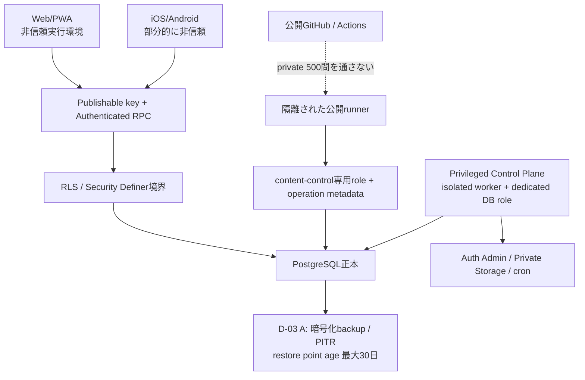

# 脅威モデル v2

## 1. 目的と範囲

本書は、JSTQB学習アプリの認証、学習同期、問題配信、採点、問題公開、backup、CI/CDに対する脅威と防御を定義します。対象はWeb/PWA、iOS、Android、端末DB、Supabase、GitHub Actions、問題公開runnerです。

個人利用であっても、次を前提にします。

- ブラウザ利用者はbundle、IndexedDB、通信を閲覧できる。
- モバイル端末所有者は端末backupやデバッグ情報を解析できる可能性がある。
- ネットワークは切断、遅延、再送、順序変更を起こす。
- 同じ本人が複数端末・複数tabを同時利用する。
- client入力、JWT claim、端末時計、event payloadは信用しない。
- CI dependency、Action、review statusは供給網攻撃の対象になる。
- 問題データは著作権・品質・正答漏えいの両面で保護する。

## 2. 保護対象

| 分類 | 保護対象 | 必要な性質 |
|---|---|---|
| 認証 | session、refresh token、reset link | 機密性、失効、利用者分離 |
| 学習 | draft、attempt、誤答、SRS、履歴 | 欠損なし、重複なし、本人限定 |
| 採点 | answer key、正誤、解説 | 回答前非開示、DB正本 |
| 模試 | 問題版、期限、得点、提出 | 改ざん防止、一括確定 |
| コンテンツ | 500問raw、正答、review packet | Git非追跡、公開承認、版不変 |
| 個人データ | メモ、問題報告、export、backup | 本人限定、削除可能 |
| 運用 | privileged server credential、DB password、署名鍵 | server限定、ログ非出力 |
| 供給網 | Actions、依存、成果物、check | SHA固定、出所検証、再現性 |
| 監査 | attempt、release、suspend、delete receipt | append-only、追跡可能 |

## 3. Trust boundary

### 3.1 非信頼領域

- 全client code、client state、端末時計
- publishable key
- request payload、event順序、retry回数
- browser cache、Service Worker、source map
- PR本文、外部check、可変tag

### 3.2 信頼領域

- 検証済みmigration適用後のPostgreSQL
- RLS、制約、固定`search_path`のRPC
- Environment承認済みの公開runner
- D-03 Aの暗号化されたbackup/PITR、外部署名削除監査archive

## 4. 脅威と対策

### T-01 回答前の正答漏えい

攻撃:

- static bundle、source map、IndexedDB、SQLite、learner portable export、catalog APIから正答・解説を取得する。
- 基礎tableをPostgRESTで直接読む。
- retired pin版や差分catalogの誤実装から正答を得る。

対策:

- 回答前DTOはallowlistで構築する。
- `is_correct`、answer key、総合・選択肢解説の`anon/authenticated SELECT`を撤回する。
- production buildから問題seedを除外する。
- pre-answer snapshot schemaに禁止fieldを定義し、余剰fieldをstripでなくrejectする。
- 通常演習はattempt確定後、模試はsession完了後だけfeedback RPCを許可し、revealed branchの総合/choice解説、`takeaway/commonTrap`は当該問題版canonicalへexact一致させる。
- suspendedは正答を返さない。
- suspend tombstone適用時に該当versionのfeedback cacheを削除し、表示直前にもstatusを確認する。
- offline referenceの停止/revoke itemは得点分母から除外してもfeedback ordinalから除外せず、保存済み全ordinalをexact一対一で返す。停止/revoke版は同じordinalの本文・choices・正答・解説・`takeaway/commonTrap`を持たないtombstoneだけにする。
- content-control専用internal suspend RPCはgraded未invalidated attempt、最新実効exam revision、最新offline result/feedback pair、未invalidated session itemだけを実効ID/hash付きimmutable targetへ固定する。過去/無効/not-graded/後着を除外し、workerはsession item invalidation fact ID/hashを含む生成fact/revision/link/receiptをappendする。retireは各current catalog membershipへexact一件のtombstoneをappendするだけで、pinを保持しfanout/member/linkを0件にする。
- bootstrap全sectionはowner/preview acceptanceと参照versionをlockし、suspended/fanout pending/acceptance-revoked版をcontent-null tombstone、feedback 0件にする。catalog/item invalidation適用時に端末同版本文/feedbackを原子的にpurgeし、selection basis原本・順序・lifecycle/hashは保持する。同一generationでもserver terminal/content/tombstone/factを優先する。local overlayは未ACK `session.created`、未ACK offline pack issue/consume専用command、pending answer、draft/note/bookmark/issue未ACK mutation、未解決conflictだけ、basis rebaseはrow hash exact一致かつserver lifecycle=`unconsumed`だけに限定し、terminal復活を拒否する。

証拠:

- pgTAPのACL/RPC列検査
- Web artifact/source map canary scan
- portable export/端末DB runtime schema試験
- D-03 Aの本番DB正本を含むDR backup/PITRは回答前非開示境界から分離し、KMS暗号化、通常アクセス不可、最小権限、隔離restore時の正答table ACL、restore point age<=30日、RPO<=24h、RTO<=8hを検査する
- 未回答、他人、別session、未提出模試のfeedback拒否試験
- offline reference result revisionの影響ordinalだけexcluded/null＋score/denominator再計算、feedback revisionの影響ordinalだけtombstone＋非影響保持、双方の全ordinal exact試験と、multi-user suspend workerの部分失敗・retry・同時回答試験

### T-02 他利用者データの閲覧・変更

攻撃:

- user ID、session ID、question IDを差し替える。
- JWT claimだけをprivileged server roleやadminへ偽装する。
- SECURITY DEFINER関数のsearch pathを汚染する。

対策:

- user IDを入力で受けず`auth.uid()`から取得する。
- 全user-owned tableへRLSを設定する。
- 全`SECURITY DEFINER`関数はneutral NOLOGIN function-ownerが所有し、関数実行中のdefiner identityをcaller識別へ使わない。
- client RPCはPUBLIC/anon/internal専用role/汎用server接続roleからEXECUTEをREVOKEしauthenticatedだけへgrantする。JWT `auth.uid()`からownerを導出し、null、client user ID、cross-ownerを拒否する。
- internal RPCはPUBLIC/anon/authenticated/汎用server接続role/他専用roleからEXECUTEをREVOKEし、用途ごとのexact専用NOLOGIN execution roleだけへgrantする。worker LOGIN roleには対応する一execution roleへの`SET ROLE`だけを許し、基礎table/function-owner/他execution roleへのmembershipを与えない。claim済みjob/member、lease owner/expiry/fencing tokenをRPC内で検証する。
- `search_path=''`、完全修飾名、上記最小EXECUTE grantを使用する。runtime capabilityだけは基礎tableへ到達しない固定safe RPCをanon/authenticatedへgrantする。
- roleのself updateを禁止する。
- M2で旧client互換対象以外のuser-owned learning tableとprofile設定の直接DML policy/grantを撤回し、generation付きRPCだけを許可する。

証拠:

- PUBLIC/anon/authenticated/汎用server接続role/各internal role/function-owner/worker LOGIN role別pgTAP
- client RPCの偽claim/cross-owner、internal RPCの誤execution role・直接LOGIN・claim/lease/fencing不一致、workerの未許可`SET ROLE`拒否試験
- 2利用者fixtureによるcross-user read/write拒否

### T-03 event再送・衝突による二重回答

攻撃・障害:

- ACK前に強制終了し、同じ回答を再送する。
- 同じevent IDでpayloadやoccurredAtを差し替える。
- 複数端末から同じ問題を同時確定する。
- 同時初回requestが両方未登録と判断する。

対策:

- request hashへcontract、data generation、event、kind、entity、occurredAt、payloadを含める。
- event ID単位のtransaction advisory lockを取得する。
- 同じuserとrequest hashだけを冪等成功にする。
- 有効attemptへsession/questionのunique制約を設ける。
- attemptとsync eventを同一transactionでappendする。
- 別event IDの二重回答は`ANSWER_ALREADY_COMMITTED`としてACKせず、同一intentだけlocalで`SUPERSEDED`へ隔離する。
- attempt原行は更新せず、無効化・訂正を別append-only tableへ記録する。

証拠:

- TS/SQL共通golden hash vector
- 2接続同時送信試験
- 同ID同payload成功、同ID異payload/時刻拒否
- ACK前kill後の再送E2E

### T-04 Pull不正rowによるcursor欠損

攻撃・障害:

- 一pageへ未知kind、不足field、不正semantic eventを混ぜる。
- 不正rowだけ除外しcursorを先へ進める。

対策:

- page全件をstrict schemaとstate semanticで先に検証する。
- page applyとcursor更新を一つのlocal transactionにする。
- 不正一件でpage全体をfail-closedにする。
- raw件数とparse件数の不一致を許可しない。
- sync/server-changeのgeneration、snapshot upper、future/逆転cursorを検証し、server changeは`requiredSyncSequence`適用後だけprojection/cursorと同transactionで適用する。
- server changeのimmutable fact ID、kind、prior fact ID、server sequence/time、content refを履歴正本とし、pull/bootstrap/export/restoreでIDを再発行・圧縮しない。`issue.updated`はissue ID、old/new status、reasonを必須とし、操作actorをserver-side principal snapshotへ結合、portable時だけactor mapへ射影して、許可遷移だけをappendする。
- bootstrapはselection basis原本/lifecycle/hashを不変に保ち、safe contentを`available`または`suspended(content=null)` strict unionで返す。portable exportは本文/choicesを持たない別型とする。
- server側のbasis discard reasonは通常`user_discarded`、直前restore dry-runが列挙したcurrent-generation basisだけ`restore_empty_namespace_cleanup`を許可する。command receiptとdiscard factを同一server transactionで固定し、restore finalizeの暗黙discardを禁止する。旧generation namespaceはserver command/factへ渡さず、端末内のstale namespace atomic discard auditだけが`generation_superseded`を記録する。
- generation変更時は旧namespaceをread-only stale-generation quarantineへ一local transactionで退避し、root count/hash、namespace summary/hashを固定する。各row sourceは`sync-request/client-sync-event/server-sync-event/server-change/command-request/command-receipt/bootstrap-snapshot/catalog-projection-read/local-migration`のstrict branch CHECKとする。client eventだけrequest/canonical hash必須、server `session.submitted` eventはrequest hash NULL、未ACK requestはserver sequence/canonical hash NULLとし、branch別ID、sequence/revision/received at、request/canonical/response/payload/row hashをlossless保持する。current snapshotへoverlay、再送、暗黙ACKしない。

証拠:

- 各kindの不正field試験
- 中間不正rowでstate/outbox/cursor全不変試験
- pagination境界の再取得試験
- server change fact historyのpull→bootstrap→export→restore全値一致と、`issue.updated`の他user・未知遷移・actor欠落拒否試験
- `selection-bases`の3 lifecycle branch、全branch safe snapshot、unconsumed限定consume、portable本文0件試験と、stale source 8 branch、namespace summary/hash、各kill point後のlossless復旧・旧write再送0試験

### T-05 複数tab・端末の無言上書き

攻撃・障害:

- draft/noteを古いrevisionで保存する。
- 複数tabがoutboxを二重送信する。
- account切替後に前利用者のsnapshotを読む。

対策:

- draft/noteはCASと明示的な競合解決を使う。
- Web Locksが利用可能なら同lockを使い、未対応環境はIndexedDB lease、fencing token、BroadcastChannelで送信workerを一つにする。
- accountごとにnamespaceを分離し、切替時に前stateを即時unloadする。
- server portable exportは全canonical event payload、command receipt、domain factを署名対象にし、sync cursor/outbox ACK metadataを除外する。端末pre-answer snapshotをrestore正本にしない。
- contentの著作権重複gateは、許諾・公開範囲内corpusのID/digest/scope/as-of/license review artifactをfreezeしたregistryへ結合する。registry digestはdigest自身を除くexact JCS preimageとcorpus ID順へ固定し、corpus別match countとdetected source FKを検証する。空corpus・実行後差替えを拒否し、「固定corpus一致0＋独立human review」の範囲だけを主張する。
- accountability reviewはbuild-pinned issuer trust bundleでEd25519検証したhuman/recent-auth/purpose/audience/期限/nonce一回使用のidentity assertion artifactをappend-only保存する。署名対象へcontent ref、subject hash、statement version/hashを含め、statement literal registry/digestへ一致させる。nonce/public key/signatureはbase64url no-paddingの32/32/64 bytesだけを許可し、A/B swap、bundle自己申告principal、machine actor、別audience、期限切れ、replay、別principalを拒否する。これはcontrolled service assertionであり、自然人の否認防止署名とは扱わない。

証拠:

- 2 tab E2E
- keep-local/accept-remote/merge試験
- account A→B切替のデータ非表示試験
- restore専用jobがserver署名済みevent IDを保持し、cursor/ACK metadataを移植しない試験
- identity対象一field変更・A/B swap・statement差替え・base64 decode長不正の拒否と、service assertion表示のsnapshot試験

### T-05A 選定snapshot・personal previewの混同

攻撃・障害:

- clientがsync/change/projection revisionを都合よく組み合わせ、誤答・未回答候補を偽る。
- 古いpreview acceptance cacheや別ownerのreviewing版を現在のcatalogへ混ぜる。

対策:

- DBが同一transactionでselection basisをimmutable発行し、clientはbasis IDだけをsession作成へ送る。
- basisへDB選定済み問題版、順序、choice order、`PreAnswerQuestionDto`だけのsafe内容を固定し、clientに過去revisionの候補再現や任意item指定をさせない。
- preview acceptanceとactive selection eventをappend-onlyで分け、owner/certification/syllabusごとのactiveをexact 1件にする。
- preview cache/session/projectionをdata generation、acceptance ID、bundle ID、canonical hash、manifest hash、selection revisionへ結合する。
- 未consume basisの破棄は行削除でなくappend-only discard factとcanonical terminal responseを作り、以後のconsume/session作成を拒否する。discard再送は同じresponseへ収束するが、discard basis/fact/command request/receiptはserver/local control audit限定とし、portable export/restore replayへ一切含めない。

証拠:

- interleaved stream、offline pending、他人basis、future/内容検証不能basis拒否試験
- preview切替競合、旧cache、別owner、revoke、既存pin再開試験
- basis discard後consume拒否、冪等再送、非開示export試験

### T-06 端末保存前の画面遷移

障害:

- 保存queue失敗・容量不足でも次問へ進み、選択を失う。
- 保存promiseが失敗後に詰まり、その後の保存が動かない。

対策:

- domain、outbox、checkpointを一transactionでcommitする。
- commit成功後だけ画面遷移する。
- 保存queueは失敗を次の処理へ伝播させず、最新durable stateへrollbackする。
- STORAGE_FAILEDで操作を明示的に停止する。

証拠:

- storage failure injection
- 選択直後、確定直後、位置変更直後のkill試験
- 一度失敗後の次保存成功試験

### T-07 模試期限・得点の改ざん

攻撃・障害:

- client時刻、startedAt、expiresAt、scoreを変更する。
- 提出時に一部だけattemptを保存する。
- suspended問題を誤答として数える。

対策:

- session row lock取得後に一度取得した`clock_timestamp()`で開始・受信・期限を判定し、transaction開始時刻の`now()`を期限判定へ使わない。
- serverが40問・配分・版を検証する。
- terminal RPC一transactionでattempt、item result、score、sessionを確定する。
- suspendedを分母から除外し、有効分母40未満は合否なしのinvalidated結果とする。
- offline回答の保証水準を成績に記録する。
- manual/read/scheduled sweeperをsession lockとunique finalizer keyへ収束させ、server-owned UUIDv5 terminalを一度だけ生成する。
- `exam-blueprint.v1`の40問、60分、26点、章/K配分とhashをsession/result/feedback/offline referenceへ固定し、単一/複数選択比率は制約しない。
- 期限後draftは`exam_input_closed` canonical ACKと保存済みterminal responseを返し、clientは両方を同じlocal transactionで適用してoutboxを終了する。late draftはpre-deadline draft、採点入力、terminal/item resultを上書きしない。

証拠:

- 40問fixture、60分境界、同時提出、再提出
- lock待ち中に期限を跨ぐdraft/manual/read/sweeper競合
- transaction途中エラー時の全件rollback
- suspended混入時の分母・表示試験
- late draft、manual/read/sweeperのbarrier試験とACK/terminal適用間kill/restart試験

### T-08 問題公開の承認流用・改ざん

攻撃:

- canonical hashが同じとして別raw bundleへ承認を流用する。
- actor IDを自己申告する。
- attestation後にreviewing rowを変更する。
- 無関係bundleのattestationで全importを凍結する。
- direct DMLでpublishedを作る。
- personal manifestのreview/provenance/oracle artifactを差し替える、配列を並べ替える、同じreviewを重複計上する。
- allocation/blueprint/quality/corpus/review等の自己hash field・配列順・除外fieldを実装ごとに変え、同じ表示値へ別preimageを与える。
- content hash由来seedや複数seed候補から都合のよいpersonal human review対象を選び、再発行でレビュー対象をgrindする。
- public manifestへ別personal manifestを親として結合する、またはpersonal hashをpublic hashとして流用する。
- 500問を501問へ増やす、章/K/64 LO、single/multiple、pattern family閾値をgate後に変更する。

対策:

- raw、canonical、manifestの全hashへ本人attestationを結合する。
- actorは`auth.uid()`から取得する。
- attestation/approval/auditをappend-onlyにする。
- import IDと全hashを正しくjoinしてimmutable範囲を限定する。
- controlled private artifact、private/独立canonical一致、sampling/review、immutable manifestをprivate release storeで完了した後にだけstageする。content-control stage transactionがprivate object version/etag/raw hashを再検証し、DB canonicalを再計算してcontent import、import versions、review/provenance artifacts、manifestを同時appendする。manifest前のDB importを拒否する。publish/retire/suspendは`content-release-v2`と`content-control` capabilityを満たすcontent-control専用internal RPCだけが実行し、DB canonicalと全attestation/source metadataを再検証する。
- private canonicalへ重複なし・昇順の`correctChoiceStableIds`を含め、正答だけの変更でもcontent/canonical/manifest hashと旧acceptance/attestationを失効させる。
- 正答集合を唯一のauthorable正本とし、release candidate/canonical入力へchoice正答booleanを持たせない。初期schemaの物理`choices.is_correct`はlegacy read-only派生mirrorへ隔離し、deferred constraintでanswer keyとのtransaction終端完全一致を強制する。learner/authoring直接DMLを撤回し、将来cutoverで列を削除する。asked claim、premise、reasoning step、addressed claim/factの参照完全性をstrict schemaで検証する。
- personal/public manifestを別のstrict outer envelopeとhashにし、personalは全500のmachine/blind/provenanceと独立numeric oracle artifact、publicは親personal hashと全500の技術・編集・表示reviewを拘束する。numeric artifactはblueprintの`ClaimCalculationV1`をcontent ref＋claim key unique/sortでlosslessに射影し、formula ID、scalar/rational/rational-list inputs、中間値、丸めmode/scale、scalar/ordered-set expected/oracle値、unit、全choice bindingを保持する。
- manifest配列の規定順、subject組合せ、重複0、exact coverage、allocation/blueprint/quality registry digestをpublish直前に再検証する。
- allocation/blueprint/quality/corpus/review/oracle/provenance-accountability coverage hashはblueprint §3.2.1だけを唯一の正本とし、API/DBの同名定義は生成表示とする。exact JCS preimage、除外field、配列順だけを用い、literal goldenで自己hash、配列swap、1 bit、Unicode差、未知fieldを拒否する。domain separatorは`UTF8("literal") || 0x00 || JCS(...)`で表す。accountabilityはcanonical content hashとは別の`subjectHash`を対象とし、`statementHash=SHA-256(UTF8(statementLiteral))`へ固定する。
- allocation値はactor/timeを含まないimmutable `content_allocation_definitions`、owner判断はAPI exact `content-allocation-approval-artifact.v1`へ分離する。artifactはauthenticated ownerのD-04 recent-auth記録でありAPI未定義署名fieldを追加しない。manifestのhuman review coverageはsampling ID/hashと`reviewCoverageHash`だけを正本にする。
- personal human review seedはcanonical/blueprint/allocation/quality-gateと候補stratumのfreeze後、controlled serviceが同じfreezeへCSPRNG 32 bytesを一回だけ発行する。`UNIQUE(samplingFreezeHash,schemaVersion)`の署名済みappend-only完全sampling artifactへ`canonicalHash/blueprintHash/allocationHash/qualityGateConfigHash/samplingFreezeHash`、seed、全population/rank/cutoff/必須選択理由/final集合をlosslessに結合し、再発行・seed選別・content hash導出を禁止する。reviewer/resultは別のreview artifactへ保存し、final集合をexact被覆する。順位はdomain-separated JCS preimageのSHA-256 bytes順とする。
- quality/review/provenanceの全digest/hashはlowercase SHA-256、全ID/provider/model/runはtrim後non-emptyとし、空・placeholder・不正digestを全境界で拒否する。
- controlled artifactは固定private object tupleでcreate-onlyとする。human enqueueはrequested-by principalとhuman request/response hash、job/claimは別のinternal operation principalとinternal request hash、operation/target/lease/fencing/capabilityを固定し、主体・preimageのコピーまたは等値制約を禁止する。human recent-authはaccept/activate/revoke/attestとUI suspend/retire enqueueでだけ消費し、stage/publish/suspend/retire internal receiptはreauth NULLとする。保存internal receipt replayはACL/ID/kind/internal principal/internal hash一致をlease freshness/claim再消費より前に検証する。任意URL/client key、未claim、authenticated direct internal callを拒否する。
- issue管理更新はDB transition registryの`open -> investigating/resolved/rejected`と`investigating -> resolved/rejected`だけを許し、terminalからの再open、self/未知遷移、statusとresolutionの不可能な組合せをfact/current/change確定前に拒否する。
- published/currentの直接DMLをtriggerで拒否する。

証拠:

- rawだけ変更、actor重複、revoke後、別bundle、direct DML、501問、review/provenance/oracle差替え、配列並替え、親personal不一致のpgTAP/contract test
- publish成功時のaudit全値一致
- 同じoperation再送の保存済みresponse完全一致、別actor/reauth/request hash拒否
- 正答だけswapしたliteral fixtureで3 canonicalizerのbytes/hash一致と旧承認拒否
- 全補助hashのliteral JCS/UTF-8/SHA-256 golden、numeric claim lossless artifact、quality/review ID/digest negative fixture、selection seed再発行・grinding・domain省略拒否試験
- release RPCのunknown/欠落/余剰field、同operation ID異内容、publish lock待ち中revokeのbarrier試験

### T-09 問題データ・秘密のGit漏えい

攻撃・障害:

- 500問、seed SQL、review packet、privileged server credentialをcommitして削除する。
- rename、分割NDJSON、別拡張子、artifactで境界検査を迂回する。
- logや失敗診断にtoken・問題本文を出力する。

対策:

- HEAD到達履歴、remote refs、tagを決定的に検査する。
- 問題構造・正答marker・高entropy secretを内容ベースで検出する。
- private pathを0700、fileを0600にする。
- CIへprivate inputを渡さず、artifact uploadを禁止する。
- 診断出力をallowlist化しsecretをredactする。SQLSTATE、constraint/table/column、stack、internal principal/job/lease、policy/digest/key、private object tupleはpublic error detailへ出さず、固定public error codeと安全な復旧操作だけを返す。A11yの`aria-live`/読み上げ文も同じ安全な短文を使い、内部詳細は専用role限定の署名監査証跡へ分離する。

証拠:

- synthetic一時repoでcommit後削除、rename、split、SQL、binary偽装の検出試験
- CI artifact一覧とlog scan

### T-10 Service Workerの利用者応答cache

攻撃:

- Authorizationの異なる同一URLをCache Storageで共有する。
- logout後に前利用者のAPI応答をoffline表示する。

対策:

- Service Workerはsame-originの静的assetとnavigation shellだけをcacheする。
- API、auth、Authorization付きrequestをcacheしない。
- response ok、method、origin、scopeを確認する。
- logout/account切替時にuser namespace cacheを破棄する。

証拠:

- user A online応答をuser B offline要求で受け取れないE2E
- cross-origin/API requestのCache Storage不存在確認

### T-11 Supply-chain・偽check

攻撃:

- 可変Action tag、悪意あるdependency、任意branch dispatchを本番へ配布する。
- write権限者が同名status contextを発行する。

対策:

- Actionsをfull commit SHAへ固定する。
- checkout credentialsを残さない。
- GitHub Actions App ID 15368の5 checksだけをrequiredにする。
- strict latest main、thread resolution、squash-only、bypassなし。
- deploy時にexact main SHAのcheckをAPI再検証する。
- DB、Pages、content、mobileを別Environment権限へ分離する。
- client deploy前にappend-only署名済みruntime capability snapshotのenvironment/revision/main SHA、migration/worker、RPC signature、ACL、old/new smoke、期限を検証する。`content-release-v2`は`content-control` worker、専用ACL、production DBに明示保存したcryptographic release requirement値を必須とする。明示falseならD-01のP0 recent-auth契約を許可し、明示trueなら`cryptographic-release-attestation-v1`未達のacceptance/attestation/stage/publishをOFFにする。field欠落・未知値・署名不正をfalseへdefaultせずrelease featureをOFFにする。暗号要件未達でもglobal suspendのDB拒否と既に配備済みの緊急suspend開始RPCは維持し、操作固有のworker/RPC/ACL依存が欠ける操作だけをOFFにする。
- required `database` checkはfresh、origin/main-shaped upgrade、combined migration order、異常注入時のschema/data/history全rollback、synthetic fixture production混入0を別phaseで実DB検証し、一phaseでも未実行ならdeploy capabilityを発行しない。

証拠:

- ruleset APIの実体
- workflow contract test
- 手動deployの非main/未検査SHA拒否

### T-12 Backup・削除後の残存

攻撃・障害:

- account削除後もtoken、端末snapshot、signed export、backupへ個人データが残る。
- restoreが別利用者へoutbox/cursorを移植する。

対策:

- recent reauth、session revoke、local namespace wipeを行う。
- signed exportを短期失効させる。
- restoreはpayloadからsource export/payload hash、owner/user、別々のactor principal digest/pseudonym集合、0件を含むkind別全portable fact registry、content ref、session/event/command/basis集合をbranch CHECK付き子rowへ正規化し、各count/hash/setsHash/artifactHashを再計算してdry-run sets JSON/hash・reauth・finalizeのidentity artifact一致を検証する。materialization linkは不変ID/time/hashを持ち、session-item branchのfact ID/hash/session/item、remote-source branchのkind/ID/generation/sequence/revision/received/hashをlossless保存する。legacy v1 branchはsource generation NULLとlegacy schema/event/sequence/fact hashを必須にし、存在しないcanonical hashを補造しない。restored command replayはexam.submit/session.abandon/exam.offline-referenceだけで、selection-basis discardのfact/request/receipt/lifecycleはvalidatorで拒否しarchive/linkへ保存しない。
- P0 restoreは本人の空の学習namespaceだけを許可する。dry-runはpayloadから再計算したowner/user、actor principal/pseudonym、kind別fact ID、content ref、session/event/command/basisの全集合/count/hashとupload tupleをstrict identity artifactへ固定し、active未consume basisを空でない状態として返す。明示discard後に別dry-runを要求し、finalizeは同じartifact/hash・空判定を再検証するだけでbasisをdiscardしない。
- canonical eventをclient requestとして再送せず、version adapterでappend-only domain factを取込みderived stateを再構築する。
- v1 canonical factは専用read-only archiveへ保存し、v2 event/ACK/outboxへ昇格しない。restore後はimmutable full bootstrapを全page検証してからcurrent generationのscope別cursorを一括設定する。
- bootstrapはowner限定generation discoveryから開始し、profile/safe catalog/session/attempt/exam/lifecycle/offline-reference/bookmark/note/issue/projectionに加えて`selection-bases`をsection/scope partitionへ固定する。selection basisのsafe snapshot、consume/discard lifecycle、source revision/hashをlosslessに保持し、partition count/hash/ordinal、snapshot hash、期限の全一致後だけlocal stateとcursorをatomic swapする。
- 全canonical event payloadと非sync command receiptを署名exportへ保存し、restore後の同ID再送へ保存済みresponseを返す。
- restore uploadはserver発行upload IDと固定private bucket/objectだけを使い、client URLをworkerがfetchしない。P0はserver署名済みportable JSONをTLS/private Storage/provider at-rest encryptionで扱い、create-only upload後にsize/content type/object version/etag/object SHA-256を固定してapply直前にも再検証する。
- 全user mutationは同じuser advisory keyのshared lock、restore finalizeはexclusive lockを取得する。restore成功で`data_generation`をincrementし、旧端末writeを隔離する。
- server portable exportへ問題本文・正答・解説・feedback・sync cursor/outbox/ACKを含めず、端末snapshotはrestore入力として拒否する。
- portable selection basisはconsume済みID/version/ordinal/choice orderだけを含み、prompt/body/choicesを含めない。private preview canaryがexport bytesへ0件であることを検査する。
- live DB/Auth/Storage削除は`deletionSloHours=24`、`deletionSloDeadlineAt=acceptedAt+24h` exactで完了する。backupからの実効消去は別の`backupEffectivePurgeDays=30`/retention deadlineであり、live削除を30日へ延長しない。全段で両deadlineを別fieldとしてexact結合する。

- `draft.saved`が実効attempt後に到着した場合はdraftを非更新にし、実効attempt ID/hashを両方拘束した`superseded-by-answer` canonical ACKへ収束させる。trigger/RPC/bootstrap/kill-restartで回答後draft復活0を検証する。
- learner PII FKから独立したschemaVersion=`account-deletion-ledger-entry.v2`のAPI exact ledgerと同sequenceの`ExternalAccountDeletionTombstoneV2`を作る。全段のDeletionPolicyBindingはenvironment=`production`、activation fact/revision、snapshot ID/body/hash、両期限を物理列・strict JSON・署名preimageでexact一致させる。subject lookupは専用DR KMS key `K_subject`による`HMAC-SHA-256(K_subject, UTF8("jstqb-account-deletion-subject-v2") || 0x00 || UTF8(canonicalIssuer) || 0x00 || UTF8(subject))`へ固定する。Storage owner digest値は別key `K_storage`・別domainの`HMAC-SHA-256(K_storage, UTF8("jstqb-storage-owner-subject-v2") || 0x00 || UTF8(canonicalIssuer) || 0x00 || UTF8(subject))`で導出し、external tombstoneへ値/algorithm/key IDを署名する。subject/Storageのkey IDはDB CHECKで異なることを強制する。combined receiptは`storageSubjectDigest`値と`externalTombstoneHash`をstrict JSONと署名preimageに必須化し、tombstoneの署名済み値、object keyのexact一segment、immutable metadata tupleとbyte exact一致させる。algorithm/key ID/rule versionはreceiptへ重複保持せずtombstone hashで拘束する。raw subject/user UUID、emailまたはそのprefixをledger/tombstone/external object/receipt/logへ保存しない。同じDB障害で失わない外部append-only archiveへ両署名artifactを保存し、archive sequence、同sequenceのledger entry hashとexternal tombstone hashを一つのcombined `AccountDeletionArchiveReceiptV2`へ結合・永続化するまで削除jobをcompletedにしない。D-03 Aのrestore時はbackup上限以後からtraffic切替直前までをexternal archiveから先行再適用し、archive/ledger/tombstone gap、Storage digest値の欠落・不一致、HMAC key/issuer/rule欠落、key・metadata片方だけの一致、artifact/receipt署名不一致、scope未完了ならDR昇格をfail-closedにする。release principal snapshot/public keyはlearner PIIから分離し、email等を保持しない。
- Storage owner digestはaccount deletion subject digestと異なるKMS key/domainを必須とする。削除chainはacceptedAt起点のlive 24時間deadlineとbackup 30日retention expiryを別々にexact一致させる。
- primary DB/通常backupのledger/tombstone行を両方失った場合も、旧backup内のcanonical issuer＋auth subject候補からHMAC v2を再計算し、外部archiveのledger/tombstone objectとcombined署名receiptを正本としてsequence上限までDB/Auth/Storageへtraffic前再適用する。primary row不存在を「削除対象なし」と扱わず、external archive欠落または削除受付から30日超の復元可能copy検出時はtrafficへ昇格しない。
- receiptはsession revoke前に一時download tokenで渡す。

証拠:

- delete後のreload/別端末401試験
- signed URL失効試験
- cross-user restore・client指定URL・他owner upload ID拒否
- 空でないtarget拒否と、finalize失敗時のlive namespace・generation・job applied状態不変
- generation discoveryの他owner拒否、bootstrap `selection-bases`を含むscope欠落・page欠落/重複・partition count/hash/ordinal不一致・期限切れ時のlocal state/cursor不変。stale-generation quarantine前後・current swap前kill/restartでlossless復旧、旧write再送0
- 複数revision event/commandをrestore後に再送した保存済みresponse一致と同ID異内容拒否
- 旧data generation端末のoutbox/command/cursor拒否
- retention経過後の削除証跡
- primary DB ledger/tombstone両喪失fixtureからissuer＋subject HMAC v2とledger/tombstone両hashcombined receiptによるexternal archive再適用、raw UUID残留0、archive/key/issuer欠落・gap・receipt差替え、RPO>24h、RTO>8h、restore point age>30日、削除済みdata復活時のtraffic拒否試験
- negative fixtureはfixture ID、environment/main SHA/migration/capability、実行role/RPC、期待SQLSTATE/error、拒否前後の行数/hash/cursor/job state、runner versionを署名証跡へ固定する。policy environment/schemaVersion/Storage digest差替え、controlled artifact literal違反、human/internal principal・preimage混同、identity子row/0件summary欠落、legacy canonical hash補造、revoked本文再配布、同generation terminal復活、basis mismatch overlay、remote-source metadata欠落、retire fanout生成、session invalidation session/fact ID/hash差替え、draft attempt hash欠落が想定外成功または拒否後stateを変えた場合はrelease不可。TS/SQL goldenはpolicy/Storage/object metadata、identity value/link、human/internal各preimageをbyte exact照合する

### T-13 Reauth grantの再利用・差替え

攻撃・障害:

- active JWTだけで高リスク操作を実行する。
- 一度取得したgrantを別bundle、別role、別purposeへ再利用する。

対策:

- isolated workerがIdP credentialを再検証し、5分TTL・purpose/content hash/role boundのone-time opaque tokenを発行する。
- DBはtoken hash、data generation、purpose別strict target hashだけを保存し、RPC transaction内で`clock_timestamp()`、owner、current generation、format/upload/job/report/challenge/content hash/role binding、未使用を検証して消費する。

証拠:

- expired/replay/別actor/別role/別bundle/hash差替え拒否試験
- raw tokenがDB、log、client永続領域、exportへ残らない検査

## 5. ログ方針

owner review originはlearner originから分離し、exact 7 RPCだけをauthenticated ownerへgrantし、PUBLIC/anon/service_role/一般learner/adminからREVOKEします。transition responseの`transitionReceiptId`/`operationResponseHash`はDB strict response bytesとlocal receiptへexact結合し、same operation/hashだけをbyte replayします。safe resumeはstate/revision/fact hashとblind packetだけを返します。

通常offline packは本人/generation/未consume basisへ固定したsafe prompt/choicesだけを持ちます。専用`issue_offline_practice_pack_v2`/`consume_offline_practice_pack_v2`だけを許可し、各operation ID、request/response hash、strict response JSON、receipt IDをappend-only正本へ保存します。consumeは1 pack=1 basis=1 reserved sessionとstrict `session.created`を原子的に確定し、同operation/hash replayだけを許可します。正答・解説・feedback、別owner content、期限後consume、通常sync ingestによる迂回を拒否し、kill/restartは専用command outbox replayへ収束させます。複数端末/tabで実効attemptをdraftや別回答が上書きしません。offline模試は`offline_unverified`として正式exam、SRS、readinessから型・table・RPCを分離し、端末時計の結果をverifiedへ昇格させません。

章進捗/readiness双方へexpiresAt/ttlPolicyVersionを保存して各hashへ含め、projection FKで全scope/hash/time/TTLをexact拘束します。DB nowのexact境界をexpiredとし、端末期限延長を拒否します。DataGenerationは正のsafe integer JSON number、DB BIGINT、local INTEGERを数値exact一致させ、文字列化やprecision lossを拒否します。

allocation roundingはDB CHECK、migration、RFC 8785 JCS/hash、fixtureの全境界でliteral `floor-then-largest-fractional-remainder-chapter-number-ascending-tie-break`だけを許し、似た別literal、client補正、同率順序差をfail closedにします。

ログへ次を出力しません。

- access/refresh token、cookie、Authorization
- privileged server credential、DB URL/password
- email、メモ本文、選択回答、正答、問題本文
- private bundle pathまたは内容

記録可能な項目は、request ID、operation ID、匿名化user ID、event kind、error code、duration、件数、commit SHA、run IDです。

## 6. 残余リスク

- 回答後feedbackは本人端末へ届くため、完全な正答秘匿は保証しない。
- offline端末へ配布済みのfeedbackは、緊急suspend後も次回同期まで物理回収できない。
- offline端末へ配布済みのpersonal preview本文・feedbackは、acceptance revoke後も次回同期まで物理回収できない。
- root化・jailbreak済み端末のローカルdraft機密性はOS境界に依存する。
- offline模試の端末時刻・操作時刻はserverだけでは完全証明できない。
- 個人利用のhuman review人数が不足する間は、問題を一般公開しない。

残余リスクを理由に、回答前bundleへ正答を含める、RLSを緩和する、公開承認を自己申告へ置換することはしません。
